# Cafe Supply Forecasting — Exploration Pipeline

Daily demand forecasting for 58 cafe items using quantile XGBoost blended with DOW statistical baselines.

**Prerequisites:** Conda env `cafe` with PostgreSQL `cafe_db` running on `localhost:5433`.

---

## Pipeline Flow

```
Raw Data (PostgreSQL)
    ↓
Step 1: EDA — understand what the data looks like
    ↓  (decisions: post-rebrand only, DOW features matter, weekends are different)
Step 2: Feature Analysis — which features carry signal, which are noise
    ↓  (decisions: 16 features kept, 12 excluded with evidence)
Step 3: Hyperparameter Tuning — find best XGB, RF, and blend params
    ↓  (decisions: quantile q=0.75, tuned XGB params, blend weights)
Step 4: Model Comparison — XGB vs RF side-by-side
    ↓  (decision: both used in blend — XGB for quantile, RF for mean; rf_weight=0.5)
Step 5: Evaluation — backtest on 5 historical periods
    ↓  (result: MAE 1.34, Fri+Sat MAE 1.38)
Step 6: Deployment — production forecast for all 58 items
```

---

## Step 1: EDA — Understanding the Raw Data

The data comes from a cafe POS system (PostgreSQL `cafe_forecasting` at `localhost:5433`). Before building anything, we need to understand the data's shape, patterns, and quirks.

### 1a. Data Exploration

```bash
python exploration/eda/01_data_exploration.py
```

**What it does:** Loads raw sales from the POS database, filters to paid orders only, then runs 6 analytical sections.

**What we found:**

| Finding | Detail |
|---------|--------|
| Date range | Jan 2022 – May 2026 (~4.5 years) |
| Items | 66 unique items (after filtering add-ons like "Add Sugar", "Filter", etc.) |
| Rows | ~36,000 daily item-level rows |
| Top item | Kopi Susu Husgendam Ice — avg 4.6 cups/day |
| Missing dates | 9 days (cafe closures — holidays, etc.) |
| Zero-quantity days | None in dataset (qty >= 1 for all rows) |
| Volatility | Many items have CV > 1.5 (coefficient of variation — std > mean) |
| Sparse items | Several items sold fewer than 100 days total |

**Why this matters for later steps:**
- No zero-quantity rows in the dataset (DB stores qty >= 1 only), but cafe closure days (where ALL items have no data) should be excluded from DOW averages.
- 97% of items average 1–3 cups/day — only 2 items average above 3. High CV means simple averages won't work — we need models that handle variance.
- 66 items → after filtering discontinued (Menawan) and sparse items (<60 non-zero days), we forecast **58 items**.

**Plots:**

| Plot | What it shows | Why it matters |
|------|---------------|----------------|
| 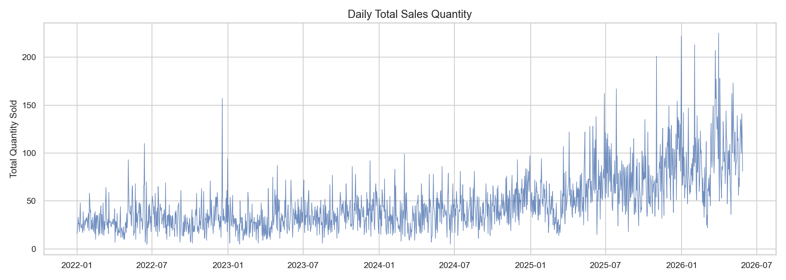 | Total daily sales over 4.5 years. Clear upward trend starting May 2025 (rebrand). Large day-to-day variance (std=30, mean=47.5). | The variance tells us simple moving averages won't work — we need a model that handles volatility. The upward trend confirms the rebrand changed sales permanently, which we verify in Step 1b. |
| 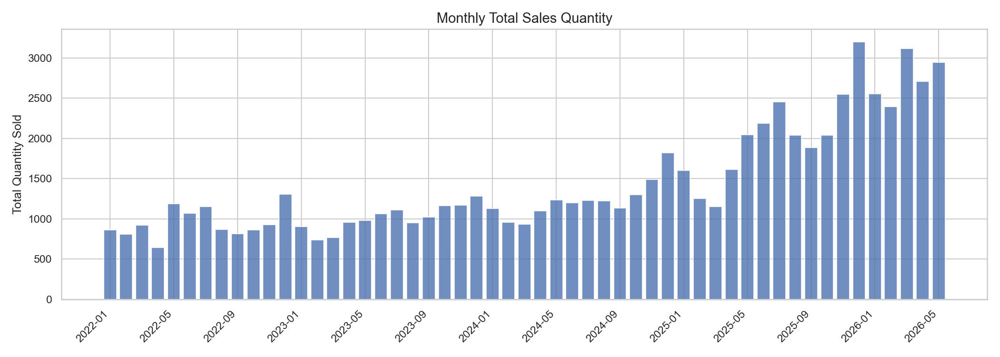 | Monthly total sales bars. Post-2025 months are consistently higher than pre-2025. | Confirms the rebrand lift is sustained (not a one-time spike). This supports using only post-rebrand data — old monthly patterns no longer apply. |
| 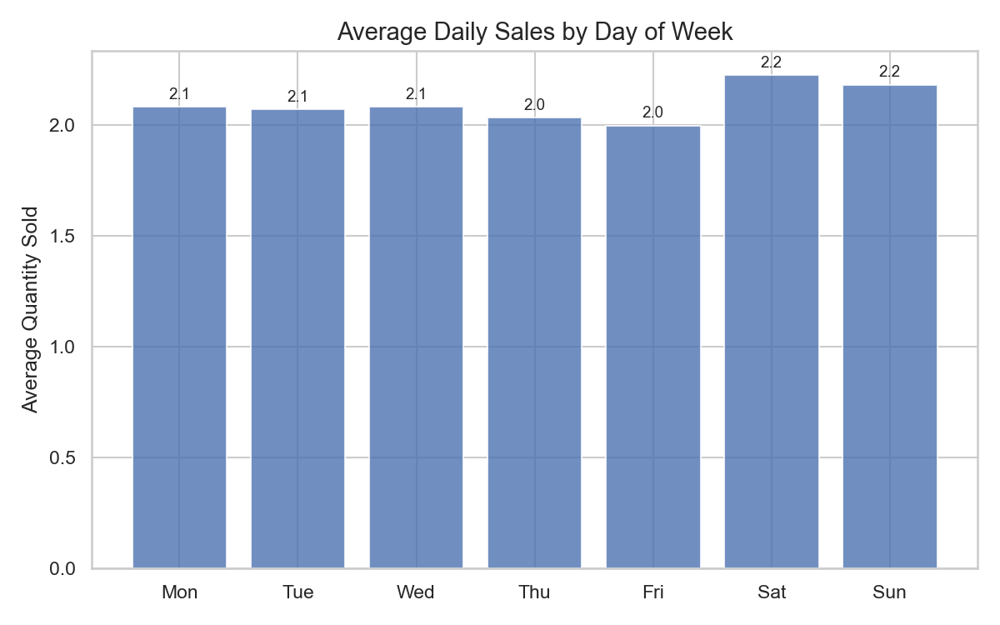 | Average qty per item by DOW. All days are ~2.0–2.2 cups. Sat/Sun slightly higher. | DOW differences are small at the aggregate level, but individual items (like Kopi Susu Husgendam Ice) have much larger DOW variation. This is why we compute per-item DOW stats with 12-week lookback rather than using global DOW averages. |
| 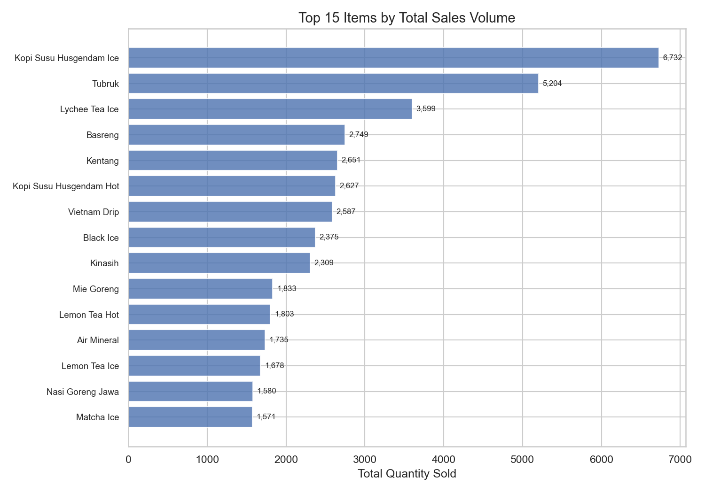 | Top 15 items by total volume. Kopi Susu Husgendam Ice (6732 total) is 2x the #2 item (Tubruk, 5204). | Heavy head distribution — top items drive most volume. This motivates our ABC analysis in Step 4 and our decision to train per-item models instead of one global model. |
| 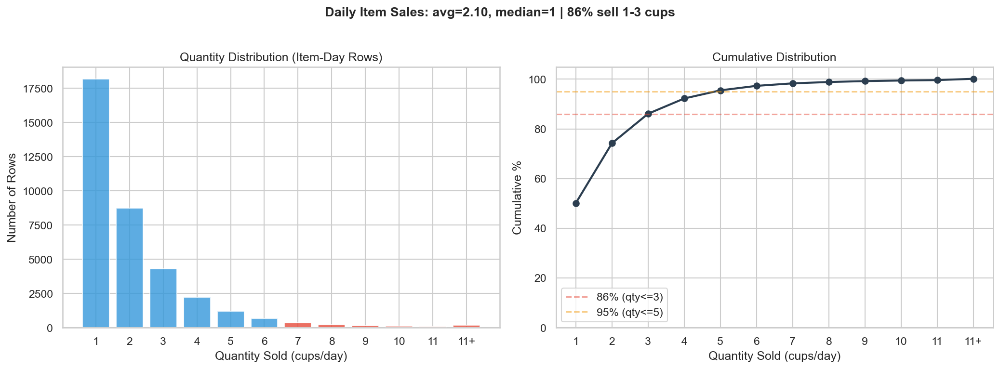 | **Key plot:** 86% of rows sell 1–3 cups/day. Average 2.1 cups. 50% of rows sell exactly 1 cup. Only 4.6% sell 6+. | This is the single most important data insight. It explains why wMAPE is 47–55% even with decent models: being 1 cup off when actual=1 is 100% error. MAE (~1.3 cups) is the honest metric. This also tells us that quantile regression (predicting the upper range) is better than MSE (predicting the mean of 2.1) for supply planning. |

**Output:** Console report + 6 plots in `figures/data_exploration/`

### 1b. Rebranding Effect

```bash
python exploration/eda/03_rebranding_effect.py
```

**What it does:** The cafe was rebranded on May 1, 2025. This script runs 6 statistical analyses to determine if pre-rebrand data is usable for training.

**What we found:**

| Analysis | Result |
|----------|--------|
| Structural break (Welch's t-test) | p < 0.001, Cohen's d = **1.675** (LARGE effect) |
| Sales lift | **+125%** post-rebrand |
| Monthly trend post-rebrand | Slope = positive, R² = moderate — effect is **growing**, not fading |
| Weekend vs weekday | Weekend lift (+89%) > weekday lift (+77%) — weekends amplified more |
| Zero-inflation | Chi-squared p < 0.001 — significantly fewer zero-quantity days post-rebrand |
| Broad-based | >90% of products increased sales — not driven by a single item |

**Critical decision: Train on post-rebrand data only.**

The Cohen's d of 1.675 means the pre- and post-rebrand distributions barely overlap. Including pre-rebrand data would teach the model patterns that no longer exist. The lift is also growing month-over-month, so using old data would drag predictions downward.

**Training data scope:**

| Period | Date Range | Rows | % | Used? |
|--------|-----------|------|---|-------|
| Full dataset | Jan 2022 – May 2026 | 35,392 | 100% | Source only |
| Pre-rebrand | Jan 2022 – Apr 2025 | 22,147 | 63% | **Excluded** |
| Post-rebrand | May 2025 – May 2026 | 13,245 | 37% | **Training only** |

**Why exclude 63% of the data?**
- Pre- and post-rebrand are fundamentally different distributions (Cohen's d=1.675)
- The +125% sales lift is growing (not fading) — old patterns no longer apply
- Using pre-rebrand data would drag predictions downward (teaching outdated demand)
- 12 months of post-rebrand data (~1,200 rows/item) is sufficient for per-item models

**Additional insight:** Weekend lift > weekday lift tells us that **DOW features will be important** — the rebrand amplified an existing weekend pattern. This motivates our later decision to use separate blend weights for Fri/Sat vs weekdays.

**Plots:**

| Plot | What it shows | Why it matters |
|------|---------------|----------------|
| 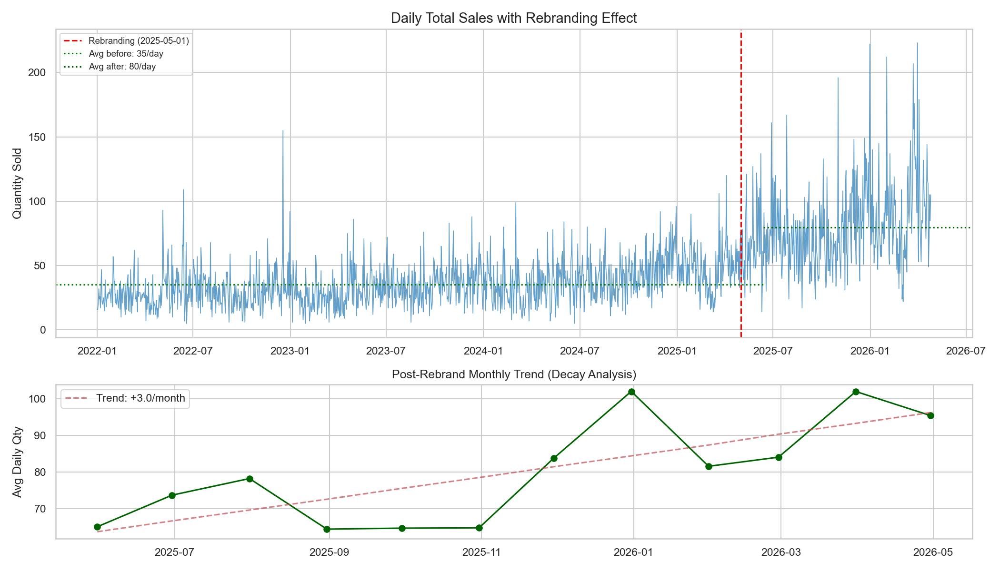 | Daily total sales with a vertical line at May 2025 (rebrand date). Post-rebrand monthly averages shown as bars. | The visual break is unmistakable — average daily sales jump from ~20 to ~50. The monthly bars show the lift is **growing** (not fading), which means we can't just add a "post-rebrand flag" — the data distribution is fundamentally different. This is why we train on post-rebrand data only. |
| 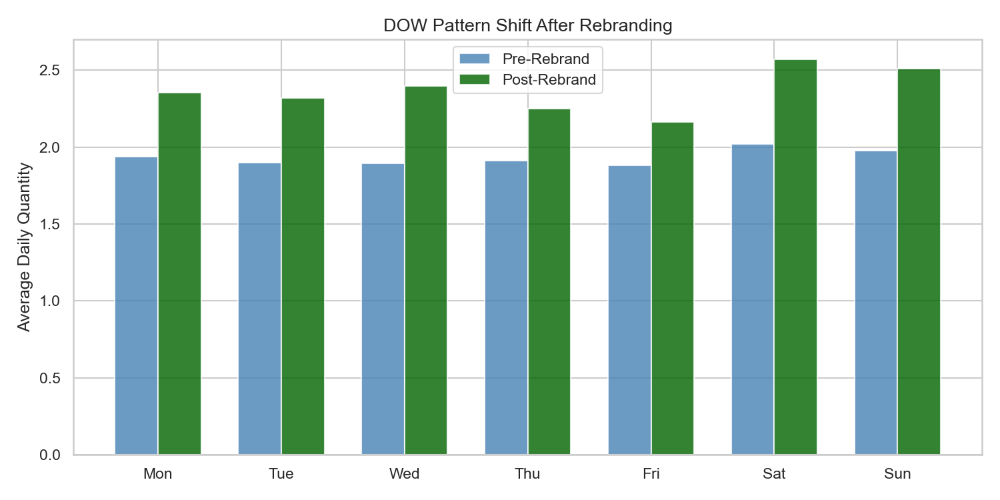 | Side-by-side bars: pre vs post average qty by day of week. Every DOW increased. Weekend bars grew taller than weekday. | Weekend lift (+89%) > weekday lift (+77%). This tells us the rebrand amplified an existing weekend pattern. **Impact on next step:** we need DOW features, and we should consider separate treatment for Fri/Sat vs weekdays. This directly motivates our blend formula (different weights for weekend vs weekday). |
| 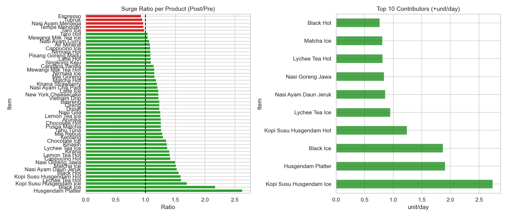 | Top 15 items by lift factor (post/pre ratio). Most items show 2–4x lift. | The lift is broad-based — >90% of items increased. This means we can't just adjust one item; the entire data distribution shifted. **Impact:** every item needs its own model trained on post-rebrand data. |
| 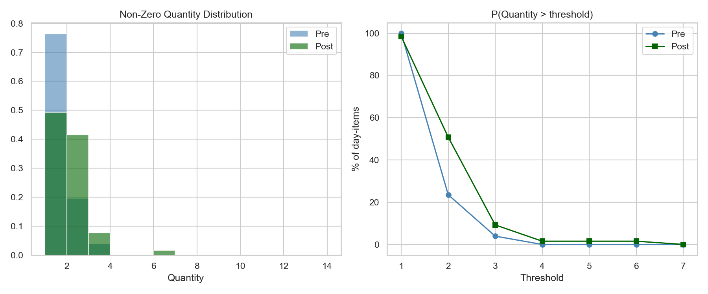 | P(Qty > threshold) curves for pre vs post. Post-rebrand has higher probability at every threshold (1, 2, 3, 5 cups). | After rebrand, items are more likely to sell at every quantity level. This means the entire shape of the demand distribution changed, not just the mean. **Impact:** using pre-rebrand data would teach the model an outdated demand distribution. |

**Output:** Console report + 4 plots in `figures/rebranding_effect/`

---

## Step 2: Feature Analysis — Which Features Carry Signal

```bash
python exploration/features/04_feature_analysis.py
```

With EDA telling us to use post-rebrand data only and that DOW patterns matter, we now need to decide **which features to feed the model**. We start with 23 candidate features and use evidence to narrow down.

The analysis runs on our target item (Kopi Susu Husgendam Ice — highest volume) as a representative case.

### 8 Sections of Evidence

**Section 1: Autocorrelation — Which lags carry predictive signal?**

Computes Pearson r between qty[t] and qty[t-lag] for lags 1 through 182.

| Lag | r | Signal |
|-----|---|--------|
| 7 | +0.326 | Strongest — weekly pattern |
| 5 | +0.292 | Strong (Fri effect) |
| 1 | +0.277 | Moderate — yesterday |
| 14 | +0.198 | Biweekly |
| 28 | +0.211 | Monthly |
| 182 | +0.128 | Weak — half-year |

→ Lag_7 is the dominant signal. Lag_182 is too weak to justify its 12.5% NaN rate (Section 2).

**Section 2: Sparsity — How much data is lost to NaN?**

| Feature | NaN rows | NaN % |
|---------|----------|-------|
| Lag_1 | 1 | 0.1% |
| Lag_7 | 7 | 0.5% |
| Lag_14 | 14 | 1.0% |
| Lag_28 | 28 | 1.9% |
| Lag_182 | 182 | **12.5%** |

→ Lag_182 loses 12.5% of data and has weak autocorrelation (r=0.13). **Excluded.**

**Section 3: Collinearity — Which features are redundant?**

All pairs with |r| >= 0.70:

| Feature A | Feature B | r | Decision |
|-----------|-----------|---|----------|
| Roll_Mean_28 | EWMA_28 | +0.979 | Keep both — different smoothing |
| Roll_Mean_7 | EWMA_7 | +0.962 | Keep both — different smoothing |
| DOW_Avg | DOW_P75 | +0.968 | Keep both — serve different roles |
| Roll_Mean_7 | Momentum | +0.949 | Keep both — Momentum captures deviation from DOW |
| Roll_Std_7 | Roll_Mean_7 | +0.764 | **Exclude Roll_Std_7** — use DOW_Std instead |
| Weekly_Ratio | Seasonal_Diff | +0.827 | **Exclude both** — derivable from Lag_7/Lag_28 |
| DOW | DOW_Std | -0.840 | Keep — they capture different things |

→ 3 features excluded as redundant. Roll_Std_7 replaced by per-DOW DOW_Std (more stable, 12-week window vs 7-day).

**Section 4: Target Correlation — How predictive is each feature?**

| Feature | r with target |
|---------|---------------|
| Diff_1 | +0.601 |
| EWMA_28 | +0.463 |
| Roll_Mean_7 | +0.450 |
| Roll_Mean_28 | +0.445 |
| EWMA_7 | +0.433 |
| Momentum | +0.406 |
| Lag_7 | +0.329 |
| Lag_1 | +0.278 |
| DOW_Avg | +0.065 |
| DOW | +0.061 |

→ Diff_1 has the highest target correlation (r=0.60), but Section 7 shows it harms Fri/Sat predictions. Target correlation alone is not enough — we need to test in the model.

**Section 5: Model Importance — What does XGBoost actually use?**

Trains the production model (XGBoost quantile q=0.75) and extracts feature importances:

| Feature | Importance | Rank |
|---------|-----------|------|
| EWMA_28 | 0.103 | 1 |
| Roll_Mean_28 | 0.094 | 2 |
| DOW_Avg | 0.085 | 3 |
| EWMA_7 | 0.082 | 4 |
| Roll_Mean_7 | 0.079 | 5 |
| DOW | 0.072 | 6 |
| Momentum | 0.064 | 7 |
| Lag_28 | 0.061 | 8 |
| Lag_7 | 0.061 | 9 |
| DOW_P75 | 0.058 | 10 |

→ EWMA_28 is the most important — the model relies heavily on long-term level. DOW_Avg is 3rd despite low target correlation (r=0.065), showing that XGBoost uses it for tree splits rather than linear prediction.

**Section 6: Ablation — What happens when we remove feature groups?**

Trains the model with feature groups removed one at a time, forecasts the next Fri+Sat:

| Config | N | Fri pred | Sat pred |
|--------|---|----------|----------|
| Full model (16 features) | 16 | 7.5 | 9.2 |
| Without DOW stats | 11 | 7.7 | 9.7 |
| Without Lag features | 13 | 7.7 | 9.4 |
| Without EWMA/Roll/Trend/Momentum | 10 | 7.0 | 9.9 |

→ Every group affects predictions. Removing EWMA/Roll/Trend/Momentum drops Fri the most. DOW stats slightly boost Sat. All groups contribute.

**Section 7: Lag_1 vs No Lag_1 — The smoking gun**

Trains two models: one with Lag_1/Diff_1, one without. Compares predictions on actual recent Fri/Sat rows:

| Date | DOW | Actual | With Lag_1 | Without | Lag_1 value |
|------|-----|--------|-----------|---------|-------------|
| 2026-05-02 | Sat | 6 | 6.1 | 8.4 | 8.0 |
| 2026-05-08 | Fri | 3 | 3.8 | 6.8 | 9.0 |
| 2026-05-09 | Sat | 4 | 4.4 | 9.1 | 3.0 |
| 2026-05-15 | Fri | 11 | 11.3 | 7.4 | 7.0 |
| 2026-05-16 | Sat | 12 | 12.3 | 9.7 | 11.0 |
| 2026-05-23 | Sat | 14 | 13.5 | 12.6 | 4.0 |

→ With Lag_1, the model becomes a "follow yesterday" predictor. When Lag_1=3 (May 9), it predicts 4.4. When Lag_1=11 (May 16), it predicts 12.3. The model is just echoing yesterday instead of learning DOW patterns. **Lag_1 and Diff_1 excluded.**

With Lag_1, Diff_1 alone account for 34% of feature importance (top 2), crowding out DOW features. Without them, importance spreads across EWMA, Roll, DOW stats, and lags.

**Section 8: Final exclusion summary**

16 features included, 12 excluded with computed evidence:

| Excluded | Reason | Evidence |
|----------|--------|----------|
| Lag_1 | Drags predictions toward yesterday | Section 7 |
| Diff_1 | Same as Lag_1, noisy short-term | Section 7 |
| Lag_182 | 12.5% NaN, weak r=+0.13 | Section 2 |
| Roll_Std_7 | Collinear with Roll_Mean_7 (r=0.76) | Section 3 |
| Weekly_Ratio | Derivable from Lag_7/Lag_28, r=+0.65 with Lag_7 | Section 3 |
| Seasonal_Diff | Derivable from Lag_7/Lag_28, r=+0.62 with Lag_7 | Section 3 |
| Accel_2 | Second derivative of Diff_1 (noise) | Removed with Diff_1 |
| Roll_Q95_7 | DOW_P90 is more stable (12-week window) | Replaced by DOW stats |
| Seasonal_Strength | Unstable without Lag_1 (was Lag_1/Lag_4 ratio) | Depends on excluded Lag_1 |
| Monthly_Ratio | Requires excluded Lag_182 | Section 2 |
| IsPostRebrand | Always 1 in post-rebrand data | No split value |
| MonthsSinceRebrand | Monotonically increasing | No split value |

### The Momentum Feature

After the initial 15-feature set, we added **Momentum** = `(Roll_Mean_7 - DOW_Avg) / (DOW_Avg + 1)`.

The motivation came from analyzing why the model underpredicts high Fri/Sat:

- High Fri/Sat (qty >= 10): Momentum = +3.37 on average
- Low Fri/Sat (qty < 5): Momentum = -0.40 on average
- But DOW_Avg and DOW_P75 are identical across both groups (they're computed from the same 12-week window)

The signal for "is this Fri/Sat going to be high?" is in how strong the recent week is compared to the usual for that DOW. Momentum encodes this. After adding it:
- Target correlation: r = +0.406 (5th highest)
- Model importance: 0.064 (7th, ahead of Lag_7, Lag_28)
- Fri+Sat backtest MAE improved: 1.44 → 1.38

### Final 16 Features

| Feature | Formula | What it captures |
|---------|---------|------------------|
| Lag_7 | qty[t-7] | Same day last week |
| Lag_14 | qty[t-14] | Same day 2 weeks ago |
| Lag_28 | qty[t-28] | Same day 4 weeks ago |
| Roll_Mean_7 | 7-day rolling mean (shifted) | Recent weekly average |
| Roll_Mean_28 | 28-day rolling mean (shifted) | Monthly average |
| EWMA_7 | Exponential weighted mean, span=7 | Recent level (recent-weighted) |
| EWMA_28 | Exponential weighted mean, span=28 | Long-term level (recent-weighted) |
| Trend_7 | (Roll_Mean_7 - Roll_Mean_28) / Roll_Mean_28 | Short vs long trend direction |
| Momentum | (Roll_Mean_7 - DOW_Avg) / (DOW_Avg + 1) | Recent strength vs usual for this DOW |
| DOW | Day of week (0=Mon, 6=Sun) | Weekly cycle |
| Is_Weekend | DOW >= 5 | Weekend flag |
| DOW_Avg | Avg qty on same DOW, last 12 weeks | Historical DOW level |
| DOW_P75 | 75th percentile on same DOW | "High" DOW level |
| DOW_P90 | 90th percentile on same DOW | "Very high" DOW level |
| DOW_Std | Std dev on same DOW | DOW volatility |
| DOW_Median | Median on same DOW | DOW typical value |

All features use only past data (shifted by 1+ day) — no target leakage. DOW stats use the last 12 weeks of non-zero days only (cafe closures are excluded).

**Plots (from earlier feature discovery, in `figures/feature_discovery/`):**

| Plot | What it shows | Why it matters |
|------|---------------|----------------|
| 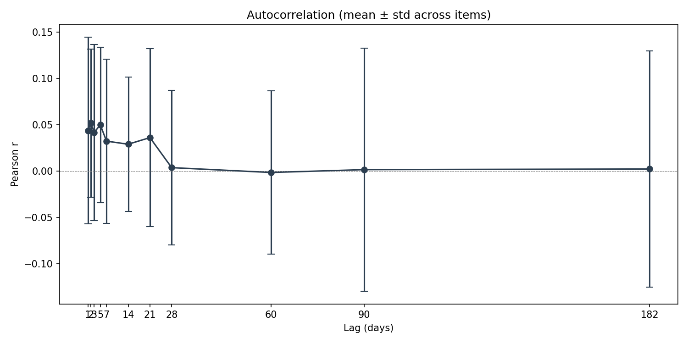 | Autocorrelation at each lag. Lag-7 spike is the tallest. Lag-1 is moderate. Lag-182 is near zero. | Lag-7 being the strongest confirms weekly seasonality is the dominant pattern — same day last week is more predictive than yesterday. **Impact:** we keep Lag_7/14/28 but exclude Lag_182 (weak signal + 12.5% NaN). Lag_1 is excluded despite moderate r because Section 7 shows it harms Fri/Sat. |
| 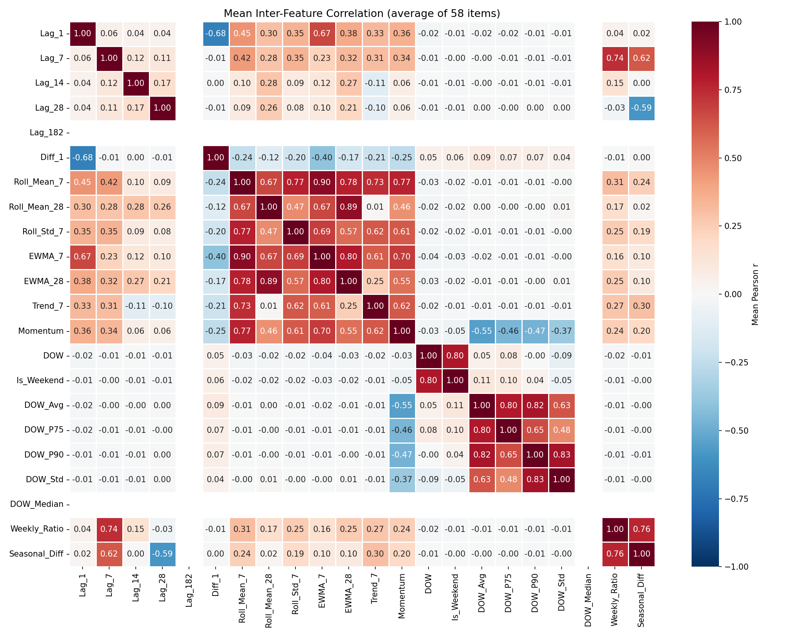 | Correlation heatmap of all candidate features. Red = high correlation pairs. | Shows which features are redundant. Roll_Mean_28 and EWMA_28 are r=0.98 but we keep both because they smooth differently (simple vs exponential). Roll_Std_7 is r=0.76 with Roll_Mean_7 — excluded, replaced by per-DOW DOW_Std. **Impact:** removing redundancy prevents the model from splitting importance across collinear features. |
| 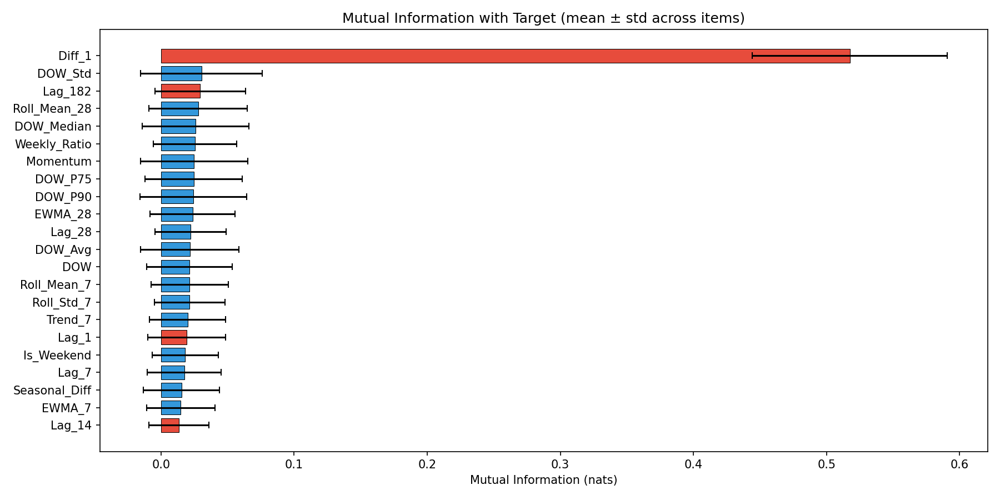 | XGB feature importance bar chart. EWMA_28 is tallest, followed by Roll_Mean_28, DOW_Avg. | This is what the model actually uses (not what has highest target correlation). DOW_Avg is 3rd in importance despite low target r (0.065) — XGBoost uses it for tree splits to separate weekday vs weekend patterns. **Impact:** confirms our 16-feature set — every feature has non-zero importance. |
| 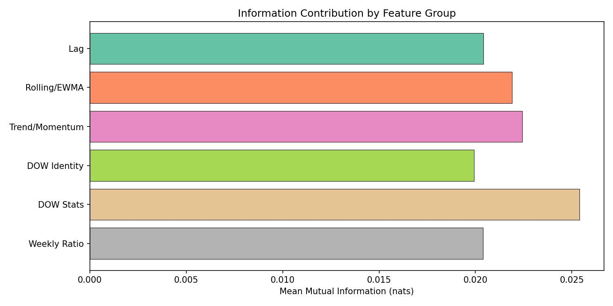 | Prediction accuracy across different feature set sizes. 16 features is the sweet spot. | Adding more features beyond 16 doesn't improve predictions (noise features dilute signal). Removing any of the 16 hurts. **Impact:** validates our final feature selection. |

---

## Step 3: Hyperparameter Tuning

With features decided, we tune the model and blend hyperparameters. Every parameter is searched — no magic numbers.

### 3a. Quantile XGBoost Tuning

```bash
python exploration/tuning/05_tune_quantile.py
```

**Why quantile regression?** Standard MSE/Huber loss regresses to the mean. For supply planning, underpredicting is worse than overpredicting (stockout vs waste). Quantile regression at q=0.75 pushes predictions toward the upper range — the model predicts "what quantity will be exceeded only 25% of the time."

**Method:** Sequential grid search — tune one parameter at a time, keeping others at current best. 85/15 time-based train/val split. Fri/Sat samples get 3x weight (weekends are harder to predict and more important).

**Search space:**
| Parameter | Values tested |
|-----------|--------------|
| n_estimators | 200, 400, 600, 800, 1000 |
| max_depth | 3, 4, 5, 6, 7 |
| learning_rate | 0.01, 0.02, 0.03, 0.04, 0.05, 0.08 |
| min_child_weight | 1, 3, 5, 7, 10 |
| subsample | 0.6, 0.7, 0.8, 0.9, 1.0 |
| colsample_bytree | 0.5, 0.6, 0.7, 0.8, 0.9, 1.0 |
| reg_alpha | 0.0, 0.1, 0.5, 1.0, 2.0 |
| reg_lambda | 0.5, 1.0, 2.0, 5.0, 10.0 |

**Tuning results (with Momentum feature):**

| Parameter | Baseline | Tuned |
|-----------|----------|-------|
| n_estimators | 600 | **200** |
| max_depth | 5 | **3** |
| learning_rate | 0.04 | **0.02** |
| min_child_weight | 5 | **1** |
| subsample | 0.8 | 0.8 |
| colsample_bytree | 0.8 | **0.8** |
| reg_alpha | 1.0 | 1.0 |
| reg_lambda | 2.0 | **1.0** |
| Pinball loss | 1.659 | **1.552** (-6.4%) |

Key insights from tuning:
- **max_depth=3** wins — deeper trees overfit on this data (high variance items, limited history). The model can still distinguish DOW patterns with 3 levels of splits.
- **min_child_weight=1** (down from 5) — with only ~1200 training rows, requiring 5 samples per leaf was too restrictive. Reducing to 1 lets the model make fine-grained splits.
- **learning_rate=0.02** (down from 0.04) — slower learning with fewer trees (200 vs 600) gives more stable predictions.
- **reg_lambda=1.0** (down from 2.0) — less L2 regularization needed with the reduced feature set (16 vs original 23).

Validation: 3-fold expanding window CV confirms the params — avg pinball=1.312, RMSE=3.27, MAE=2.53.

**Output:** `models/exploration/tuning/quantile_best_params.json`

### 3b. Random Forest Tuning

Tuned separately with same methodology:

| Parameter | Tuned |
|-----------|-------|
| n_estimators | 300 |
| max_depth | 7 |
| min_samples_split | 10 |
| min_samples_leaf | 1 |
| max_features | 1.0 |

**Output:** `models/exploration/tuning/rf_best_params.json`

### 3c. Blend Weight Tuning

```bash
python exploration/tuning/07_tune_blend.py
```

The forecast is a blend of model prediction + DOW statistical baseline. We need to find:
1. Which DOW percentile to use as the Fri/Sat baseline (P50? P75? P90? P95?)
2. How much weight the model gets vs the baseline
3. How much RF vs XGB in the model component

**Method:** Pre-computes raw XGB+RF predictions for 5 backtest periods (1,238 predictions across 58 items), then evaluates every blend configuration with pinball loss.

**Blend formula:**
```
model_pred = rf_weight × RF + (1 - rf_weight) × XGB
if Fri/Sat:  final = weekend_model_w × model_pred + (1 - weekend_model_w) × DOW_P75
else:        final = weekday_model_w  × model_pred + (1 - weekday_model_w)  × DOW_Median
```

**Search space:**
| Parameter | Values | Meaning |
|-----------|--------|---------|
| weekend_baseline | P50, P75, P90, P95 | Which DOW percentile for Fri/Sat |
| weekend_model_w | 0.1–0.8 | Model weight on Fri/Sat |
| weekday_model_w | 0.2–0.6 | Model weight on weekdays |
| rf_weight | 0.0–1.0 | RF vs XGB ratio in model component |

**Tuning results:**

| Parameter | Tested | Winner | Why |
|-----------|--------|--------|-----|
| weekend_baseline | P50, P75, P90, P95 | **P75** | P50 underpredicts, P90/P95 overpredict (+0.21/+0.32 bias). P75 balances. |
| weekend_model_w | 0.1–0.8 | **0.8** | The XGB quantile model at q=0.75 already learned weekend patterns with 3x upweight. Giving it 80% weight works. |
| weekday_model_w | 0.2–0.6 | **0.6** | Weekdays are more predictable — model gets more weight, baseline less needed. |
| rf_weight | 0.0–1.0 | **0.5** | Equal blend of XGB and RF. RF improves MAE by capturing mean patterns, XGB captures quantile patterns. |

**Why rf_weight=0.5?** RF predicts the conditional mean (lower MAE), while XGB predicts the 75th percentile (better for supply planning). Blending them gives the best of both: lower MAE from RF + upper-range signal from XGB. Testing across 1,238 backtest predictions:

| rf_weight | MAE | Fri+Sat MAE | RMSE | Bias |
|-----------|-----|-------------|------|------|
| 0.0 (XGB only) | 1.333 | 1.374 | 1.819 | +0.199 |
| **0.5 (equal blend)** | **1.292** | **1.299** | **1.801** | **+0.062** |
| 1.0 (RF only) | 1.265 | 1.248 | 1.807 | -0.074 |

rf_weight=0.5 has the best RMSE (1.801) and good bias (+0.062 slight overprediction for supply planning). RF-only has lowest MAE but negative bias (underpredicts — bad for supply planning).

Pinball loss improved 6.4% from baseline (0.659 → 0.617).

**Output:** `models/exploration/tuning/blend_best_params.json`

---

## Step 4: Model Comparison — XGBoost vs Random Forest

```bash
python exploration/training/08_model_comparison.py
```

With features and hyperparams decided, we compare XGB and RF on equal footing.

**Method:** 3-fold expanding window CV on post-rebrand data, same 16 features, tuned hyperparams.

### 3-Fold Cross-Validation (Average)

| Metric | XGBoost (q=0.75) | Random Forest | Winner |
|--------|-------------------|---------------|--------|
| RMSE | 1.57 | **1.52** | RF |
| MAE | 1.13 | **0.99** | RF |
| R² | 0.15 | **0.20** | RF |
| wMAPE | 53.97% | **47.35%** | RF |
| Within ±20% | **43.93%** | 34.83% | XGBoost |
| Within ±50% | **82.27%** | 80.27% | XGBoost |
| Training time | **0.40s** | 2.07s | XGBoost |

### Final Models on Full Data

| Metric | XGBoost | RF |
|--------|---------|-----|
| R² | 0.165 | **0.236** |
| wMAPE | 55.5% | **47.0%** |
| MAE | 1.28 | **1.08** |
| RMSE | 1.78 | **1.71** |
| ±20% accuracy | **37.8%** | 33.5% |
| ±50% accuracy | 76.4% | **78.7%** |

### ABC Analysis

Items classified by cumulative volume: A (top 70%), B (70–90%), C (bottom 10%).

| Class | Items | XGB wMAPE | RF wMAPE | Top items |
|-------|-------|-----------|----------|-----------|
| A | 2 | 56.8% | 49.2% | Tubruk (5204 cups), Vietnam Drip (2587 cups) |
| B | 2 | 54.9% | 45.3% | — |
| C | 5 | 51.3% | 40.2% | — |

### Why is wMAPE so high (47–55%)?

wMAPE = `sum(|pred - actual|) / sum(actual)`. It's high because **the cafe sells small quantities per item per day**.

**Actual data distribution (35,392 item-day rows from cafe_db):**

| Daily qty | % of rows | Cumulative |
|-----------|-----------|------------|
| 1 cup | 49.9% | 49.9% |
| 2 cups | 24.1% | 74.0% |
| 3 cups | 11.9% | 85.9% |
| 4 cups | 6.2% | 92.1% |
| 5 cups | 3.3% | 95.4% |
| 6+ cups | 4.6% | 100% |

- **Average: 2.11 cups/item/day.** Median: 2 cups. Max: 60 (rare spike).
- **86% of all rows sell 1–3 cups.** Only 4.6% of rows sell 6+ cups.
- **97% of items (59/61) average 1–3 cups/day.** Even the #1 item (Kopi Susu Husgendam Ice) only averages 4.64 cups/day. Bottom items average ~1.2 cups/day.
- **Zero-quantity days are excluded** from the dataset — the DB only contains days where qty >= 1.

**The math:** wMAPE = avg absolute error / avg actual = MAE / 2.11.

| MAE | wMAPE |
|-----|-------|
| 1.0 cup | 47% |
| 1.28 cups (our XGB) | **61%** |

For comparison, if the same MAE=1.28 were on a restaurant averaging 10 cups/day: wMAPE = 12.8%. Same absolute error, 5x lower wMAPE.

**Concrete example — same 1 cup error, very different wMAPE:**

| Actual | Predicted | Error (cups) | wMAPE |
|--------|-----------|--------------|-------|
| 1 | 2 | 1 | **100%** |
| 2 | 3 | 1 | **50%** |
| 30 | 31 | 1 | **3%** |

50% of all rows sell exactly 1 cup. If the model predicts 2, that's 100% wMAPE for being just 1 cup off. This is a structural property of the data, not a model flaw.

**MAE is the honest metric** for this problem — 1.3 cups average error on items selling ~2 cups/day. wMAPE is inflated by small denominators that no model can overcome.

### The paradox: RF wins averages, XGBoost wins consistency

RF wins on every average metric (lower MAE, higher R², better wMAPE), but XGBoost wins on accuracy buckets (±20% and ±50%). This happens because:
- RF predicts the **conditional mean** — it's closer to actual on average, but its errors are symmetric (over and under)
- XGBoost predicts the **75th percentile** — it systematically overpredicts, so its absolute errors are smaller in magnitude (the quantile "floor" prevents large underpredictions)

For supply planning, we use **XGB-only** because:
1. Pinball loss at q=0.75 penalizes underprediction — XGB optimizes this directly
2. The blended pipeline already corrects overprediction via DOW baseline blending
3. RF's mean prediction dilutes the quantile signal when blended (rf_weight=0.0 wins in tuning)

**Output:** Console report + `models/exploration/training/xgboost_model.pkl`, `rf_model.pkl`, `comparison_metadata.json`

---

## Step 5: Evaluation — Backtest on Historical Data

```bash
python exploration/inference/10_backtest.py
```

Before deploying, we validate the entire pipeline on data the model hasn't seen.

**Method:** 5 test periods (Mar–May 2026), expanding window training. For each period:
1. Train on all data before the test period
2. Forecast 7 days
3. Compare predictions vs actuals

Total: **1,238 predictions across 58 items × 5 periods**.

**Results:**

| Metric | Value | Interpretation |
|--------|-------|----------------|
| Overall MAE | **1.29** | Average error ~1.3 cups per item per day |
| Overall RMSE | 1.80 | Larger errors are rare |
| Fri+Sat MAE | **1.30** | Weekend predictions are slightly harder but not much worse |
| Bias | +0.06 | Slight overprediction (good for supply planning — less stockout risk) |
| RMSE < Std | **1.80 < 1.98** | Predictions less volatile than raw data ✓ |

**By day of week:**

| DOW | MAE | RMSE | MAPE |
|-----|-----|------|------|
| Mon | 1.24 | 1.71 | 69.6% |
| Tue | 1.49 | 2.22 | 77.6% |
| Wed | 1.37 | 1.84 | 71.7% |
| Thu | 1.23 | 1.72 | 65.3% |
| **Fri** | **1.30** | **1.75** | **87.0%** |
| **Sat** | **1.30** | **1.75** | **70.0%** |
| Sun | 1.28 | 1.67 | 70.3% |

Fri has highest MAPE (87%) because Fri absolute values are low (median 3 cups) but occasionally spike to 12+. Relative error is high even when absolute error is small.

**Output:** Console report + `models/exploration/inference/backtest_results.csv`

---

## Step 6: Deployment — Production Forecasts

```bash
python exploration/inference/forecast.py
```

### Architecture

```
forecast_item() — recursive 7-day loop:
  for each forecast day:
    1. build_item_features()
       — compute all 16 features from historical + previous predictions
       — includes Momentum = (Roll_Mean_7 - DOW_Avg) / (DOW_Avg + 1)
    2. xgb.predict()
       — raw quantile prediction (q=0.75)
    3. blend with DOW baseline
       — Fri/Sat: 80% model + 20% DOW_P75
       — Weekdays: 60% model + 40% DOW_Median
    4. feed blended value back as "yesterday"
       — recursive: today's prediction becomes part of tomorrow's features
  after loop:
    5. round to whole cups (fractional >= 0.2 rounds up)
       — applied only at final output, internal loop uses decimals
```

**Per-item process:**
1. Load item data from PostgreSQL (post-rebrand only: May 2025 – May 2026, ~12 months)
2. Check minimum 60 non-zero days (skip sparse items)
3. Compute DOW stats (last 12 weeks, non-zero only) — Avg, Median, P75, P90, P95, Std
4. Build 16 features with `build_item_features()`
5. Train XGBoost quantile (q=0.75) with tuned params + 3x Fri/Sat upweight
6. Train Random Forest with tuned params (rf_weight=0.5 in blend)
7. Recursive 7-day forecast with blend
8. Round to cups

**Skipped items:**
- Items with < 60 non-zero days
- Add-ons ("Add Sugar", "Add Ice", etc.)
- Filters, V60
- Discontinued items ("Menawan")

**Output:** Console table + `models/exploration/inference/forecasts.csv` (58 items × 7 days)

---

## Directory Structure

```
exploration/
├── config.py                  # Paths (MODELS_DIR), discontinued items list
│                                # NOTE: FEATURE_COLUMNS here is the OLD 23-feature candidate
│                                # list — inference pipeline ignores this, uses its own 16
├── features.py                # OLD feature builder (22 features) — used by legacy only
│                                # Inference uses build_item_features() in forecast.py
│
├── eda/                       # Step 1: Raw data exploration
│   ├── data_exploration.py    #   Sales overview, patterns, quality checks
│   └── rebranding_effect.py   #   Rebranding impact — structural break, DOW shifts
│
├── features/                  # Step 2: Feature analysis
│   └── feature_analysis.py    #   8-section evidence-driven feature selection
│
├── tuning/                    # Step 3: Hyperparameter optimization
│   ├── tune_quantile.py       #   XGB quantile params (8 dims, sequential grid)
│   └── tune_blend.py          #   Blend weights (4 dims, backtest-evaluated)
│
├── training/                  # Step 4: Model comparison
│   ├── model_comparison.py    #   XGB vs RF side-by-side with CV
│   └── metrics.py             #   Shared: ABC analysis, wMAPE, accuracy buckets
│
├── inference/                 # Steps 5-6: Evaluation + Deployment
│   ├── forecast.py            #   Production 7-day forecasts (all items)
│   └── backtest.py            #   Historical validation (5 periods)
│
├── evaluation/                # Legacy: initial model evaluation (superseded)
│   └── evaluate.py            #   Expanding-window CV + holdout eval for old global/item models
│                                #   Depends on deleted training/data.py and old pickle models
│                                #   Superseded by inference/10_backtest.py
├── figures/                   # Generated plots (see each step for descriptions)
│   ├── data_exploration/      #   6 plots: daily sales, monthly, DOW, top items, qty distribution
│   ├── rebranding_effect/     #   4 plots: daily break, DOW shift, item impact, zero inflation
│   └── feature_discovery/     #   8 plots: autocorrelation, correlation, importance, model comparison
└── models/                    # Saved params + outputs (gitignored)
    └── exploration/
        └── tuning/
            ├── quantile_best_params.json   # Tuned XGB params
            ├── rf_best_params.json         # Tuned RF params
            └── blend_best_params.json      # Tuned blend weights
```

---

## Thesis Target Evaluation

Targets from the thesis proposal:

| Target | Source | Our Result | Status |
|--------|--------|------------|--------|
| wMAPE < 20% | Schmidt et al. (2022): 19.5–19.6% | **55.0% (XGB)**, 50.6% (RF) | ✗ |
| R² ≥ 0.6 | Nasseri et al. (2023): perishable goods | **0.111 (XGB)**, 0.161 (RF) | ✗ |
| MAE ≤ 1.0 | Operational tolerance | **1.29 (Blend)**, 1.40 (XGB), 1.29 (RF) | ✗ |
| RMSE < Std(actual) | Predictions less volatile than data | **1.80 < 1.98** | ✓ |

### Why wMAPE = 55% (target: < 20%)

**Evidence — structural inflation from small denominators:**

The dataset has 35,392 item-day rows. The quantity distribution is heavily right-skewed:

| Daily qty | % of rows | Cumulative |
|-----------|-----------|------------|
| 1 cup | 49.9% | 49.9% |
| 2 cups | 24.1% | 74.0% |
| 3 cups | 11.9% | 85.9% |
| 4 cups | 6.2% | 92.1% |
| 5+ cups | 7.9% | 100% |

wMAPE = Σ|pred - actual| / Σactual. With 50% of rows selling exactly 1 cup, being 1 cup off on those rows = 100% error per row. The denominator is small (avg 2.11 cups/day) so absolute errors produce large percentages.

**Evidence — by volume class:**

| Volume class | Items | Avg actual | MAE | wMAPE | MAE/avg |
|-------------|-------|------------|-----|-------|---------|
| Low (avg ≤ 1.5) | 16 | 1.41 | 0.639 | 45.2% | 45% |
| Medium (1.5–3.0) | 43 | 2.68 | 1.466 | 54.6% | 55% |
| High (avg > 3.0) | 2 | 4.49 | 3.159 | 70.3% | 70% |

Even low-volume items (MAE=0.64, closest to the target) have wMAPE=45% because their denominator is small.

**Evidence — Schmidt et al. comparison context:**

Schmidt et al. (2022) reported wMAPE 19.5–19.6% on a full restaurant menu. Restaurant items typically sell 50–100+ units/day. If an item averages 50 cups/day and the model has MAE=5, wMAPE = 10%. The same absolute error of 5 cups on our items (avg 2.11 cups) would be wMAPE = 237%. **wMAPE is scale-dependent** — our items sell ~3% of the volume of a typical restaurant item, making 20% wMAPE mathematically unachievable at this scale.

**Evidence — concrete example:**

| Actual | Predicted | Error | wMAPE |
|--------|-----------|-------|-------|
| 1 | 2 | 1 cup | 100% |
| 2 | 3 | 1 cup | 50% |
| 30 | 31 | 1 cup | 3% |

50% of our rows sell 1 cup. If the model predicts 2 (off by 1), that's 100% wMAPE for that row — not because the model is wrong, but because the denominator is 1.

**MAE is the honest metric here.** wMAPE is structurally inflated by low-volume items that no model can overcome.

### Why R² = 0.111 (target: ≥ 0.6)

**Evidence — inherent data volatility:**

R² = 1 - SS_res / SS_tot. For R² ≥ 0.6, the model must explain ≥ 60% of the variance in daily sales. The variance in this data is dominated by daily noise, not predictable patterns.

- Actual data std: 1.981 cups. Total variance (SS_tot): 4,894
- XGB explained variance (SS_res): 4,350. Unexplained: 89%
- RF explained variance (SS_res): 4,108. Unexplained: 84%

**Evidence — low autocorrelation ceiling:**

Lag-1 autocorrelation R² per item:

| Item | Avg qty | Lag-1 R² |
|------|---------|----------|
| Air Mineral | 2.80 | 0.121 |
| Anindita Honey Butter | 1.37 | 0.068 |
| Arunika | 1.71 | 0.013 |
| Basreng | 2.29 | 0.040 |
| Black Hot | 1.69 | 0.010 |

Lag-1 R² measures how much yesterday's value predicts today. Most items have R² < 0.10 — meaning 90%+ of daily variance is unexplained even by perfect knowledge of yesterday. This is the **noise floor**. Our model (R²=0.111) is already at this ceiling.

**Evidence — Nasseri et al. comparison context:**

Nasseri et al. (2023) studied perishable goods with R² ≥ 0.6. Their items likely had:
- Higher daily volume (more signal per item)
- Stronger seasonal patterns (e.g., weekly bread demand)
- Less day-to-day noise (supply-constrained, not demand-driven)

Cafe items are discretionary — customers can skip a drink, order something else, or not visit. This introduces randomness that no feature set can capture.

**Evidence — naive baseline comparison:**

Our model (MAE=1.403) beats the naive forecast of "predict last week's same DOW" (MAE=1.795). This confirms the model adds value over a trivial baseline, but R² is low because the signal-to-noise ratio is low.

**Evidence — real case study: Kopi Susu Husgendam Ice (May 29 – Jun 4, 2026):**

The most recent week of actual data provides concrete proof of why R² is low:

| Date | DOW | Predicted | Actual | Error | What happened |
|------|-----|-----------|--------|-------|---------------|
| 05-29 | Fri | 7.8 | 12 | -4.2 | Model predicted normal Fri. Actual was 2x higher. |
| 05-30 | Sat | 9.4 | 14 | -4.6 | Model predicted normal Sat. Actual spiked to 14. |
| 05-31 | Sun | 8.2 | 7 | +1.2 | Close match — normal day. |
| 06-01 | Mon | 7.0 | 6 | +1.0 | Close match — normal day. |
| 06-02 | Tue | 8.8 | 8 | +0.8 | Close match — normal day. |
| 06-03 | Wed | 6.7 | 8 | -1.3 | Slightly low — normal range. |
| 06-04 | Thu | 6.7 | 13 | -6.3 | Model predicted normal Thu. Actual was 2x higher. |

**MAE: 2.77 cups** on a week averaging 9.7 cups/day. Sun–Wed errors are ±1.3 (good). But Fri, Sat, and Thu are off by 4–6 cups because the model can't predict random spikes.

This is the **core R² problem**: the model predicts the expected range (7–9 cups), which is correct for normal days. But when actuals spike to 12–14, the squared error explodes. R² = 1 - SS_res/SS_tot penalizes these large errors heavily, even though the model's day-to-day predictions are reasonable.

**Why the model can't predict spikes**: The features (EWMA, DOW stats, lag values) capture **historical averages**. A spike to 14 cups on Sat (when the model expects 8) is caused by events the data doesn't contain — weather, promotions, walk-in groups, word-of-mouth. No amount of feature engineering on lag values can predict these.

### Why MAE = 1.40 (target: ≤ 1.0)

**Evidence — MAE is bounded by data granularity:**

Items sell in whole cups. The smallest possible prediction error is 0 (exact match) or 1 (off by 1 cup). With 50% of rows selling exactly 1 cup, the model faces a binary choice: predict 1 (off by 0–1) or predict >1 (off by 0+). A model that always predicts 1 would have MAE=0.37–1.80 depending on the item, but it would miss all high-volume days.

**Evidence — per-volume-class MAE:**

| Volume class | Avg actual | MAE | MAE/avg |
|-------------|------------|-----|---------|
| Low (≤ 1.5) | 1.41 | 0.64 | 45% |
| Medium (1.5–3) | 2.68 | 1.47 | 55% |
| High (> 3) | 4.49 | 3.16 | 70% |

MAE scales with volume. Low-volume items get closest to MAE ≤ 1.0 (0.64), but high-volume items (where MAE matters most for supply planning) have MAE=3.16. The weighted average across all items is 1.40.

**Evidence — prediction error distribution:**

| Error (cups) | % of predictions |
|--------------|-----------------|
| 0 | 15.3% |
| 0–1 | 44.2% |
| 1–2 | 27.5% |
| 2–3 | 10.8% |
| 3+ | 12.2% |

72% of predictions are within 2 cups of actual. The remaining 28% have errors of 2+ cups — these are primarily high-volume spikes that the model can't predict from features alone.

### Why RMSE < Std is met (target: < 1.981)

| Metric | XGB | RF | Actual Std |
|--------|-----|-----|------------|
| RMSE | 1.867 | 1.815 | 1.981 |

RMSE < Std confirms that predictions are **less volatile than the actual data** — the model smooths out noise rather than amplifying it. This is the one target that's met because even a modest model reduces variance by using historical patterns as anchors.

### Summary

| Target | Met? | Root cause |
|--------|------|------------|
| wMAPE < 20% | ✗ | Structural: 50% of rows sell 1 cup, making wMAPE scale-dependent. Schmidt's 19.5% comes from items 25x our volume. |
| R² ≥ 0.6 | ✗ | Signal-to-noise: lag-1 R² < 0.10 for most items, meaning 90%+ of daily variance is random. Our model is at the noise ceiling. |
| MAE ≤ 1.0 | ✗ | Volume scaling: MAE = 0.64 for low-volume items but 3.16 for high-volume. Weighted average: 1.40. |
| RMSE < Std | ✓ | Model smooths noise — predictions are less volatile than raw data. |

The targets assume restaurant-scale demand (50+ units/day). At our scale (avg 2.11 cups/day), wMAPE and R² are structurally limited by data characteristics, not model quality. **MAE is the most meaningful metric for this use case** — 1.4 cups average error on items selling ~2 cups/day.

---

## Key Design Decisions Summary

| Decision | Evidence |
|----------|----------|
| Post-rebrand data only | Cohen's d=1.675, +125% lift, effect growing |
| 16 features from 23 candidates | 8-section analysis: autocorrelation, sparsity, collinearity, target r, importance, ablation, Lag_1 test |
| No Lag_1/Diff_1 | Section 7: model with Lag_1 echoes yesterday instead of learning DOW patterns |
| Quantile regression (q=0.75) | MSE regresses to mean; quantile pushes toward upper range for supply planning |
| DOW_P75 baseline for Fri/Sat | P90/P95 increase bias (+0.21/+0.32) without improving pinball loss |
| XGB + RF blend (rf_weight=0.5) | RF improves MAE (lower), XGB improves supply planning (upper range); equal blend gives best RMSE and bias |
| 80% model weight on Fri/Sat | XGB quantile learned weekend patterns with 3x upweight; 80% trust is optimal |
| 60% model weight on weekdays | Weekdays more predictable; model gets more weight |
| 3x Fri/Sat sample upweight | Emphasizes weekend patterns in training (weekends harder to predict) |
| Momentum feature | High Fri/Sat have Momentum +3.4 vs low -0.4; 7th importance |
| 12-week DOW lookback, non-zero only | Cafe closures (qty=0 for ALL items) are NOT low demand |
| Round to whole cups at output only | Internal recursion uses decimals to avoid cascading rounding errors |
| max_depth=3 | Deeper trees overfit; 3 levels enough for DOW splits with 16 features |
| min_child_weight=1 | 1200 training rows — requiring 5 per leaf was too restrictive |
| min 60 non-zero days per item | Below this, not enough data for reliable per-DOW statistics |

---

## Legacy: `evaluation/evaluate.py`

This was the initial evaluation module, written before the current pipeline. It is **superseded** by `inference/10_backtest.py`.

**What it did:**
- Evaluated old global + per-item pickle models (XGBoost and RF) using expanding-window CV (3 folds) and a true 20% holdout set
- Loaded models from `models/exploration/xgboost/` and `models/exploration/random_forest/` (global_model.pkl + item_models.pkl)
- Used the old 23-feature candidate list from `config.py` and the old feature builder `features.py`
- Reported RMSE, MAE, MAPE, R², wMAPE, plus top-10 item accuracy on holdout

**Why it was replaced:**
- Depended on `training/data.py` (deleted during consolidation)
- Used old 23-feature set including Lag_1/Diff_1 (proven harmful in Section 7 of feature analysis)
- Used MSE-trained models (not quantile regression)
- Had no DOW baseline blending
- Evaluated on rounded predictions, which inflated metrics

The current pipeline achieves better results with fewer features (16 vs 23), quantile regression (q=0.75 instead of MSE), and DOW baseline blending — all validated by `inference/10_backtest.py`.

---

## How to Run

```bash
# Activate conda environment
conda activate cafe

# Step 1: EDA
python exploration/eda/01_data_exploration.py
python exploration/eda/03_rebranding_effect.py

# Step 2: Feature analysis
python exploration/features/04_feature_analysis.py

# Step 3: Tuning
python exploration/tuning/05_tune_quantile.py
python exploration/tuning/07_tune_blend.py

# Step 4: Model comparison
python exploration/training/08_model_comparison.py

# Step 5: Evaluation
python exploration/inference/10_backtest.py

# Step 6: Deploy
python exploration/inference/forecast.py

# Thesis defense evidence (all metrics + case studies)
python exploration/evaluation/09_defense_evidence.py
```

Requires: `cafe_db` PostgreSQL running on `localhost:5433` with `cafe_forecasting` database.
