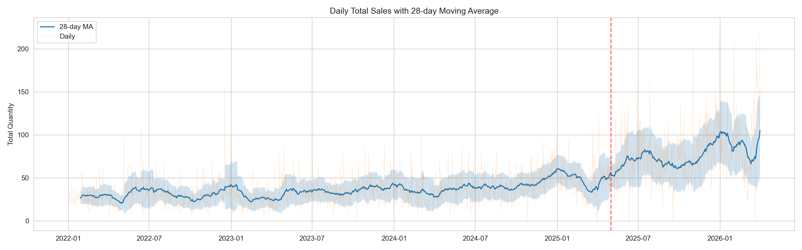
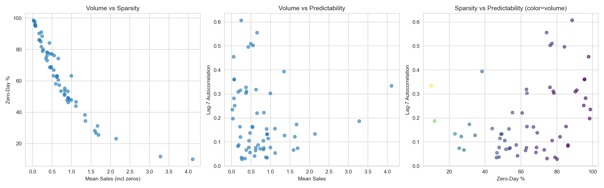
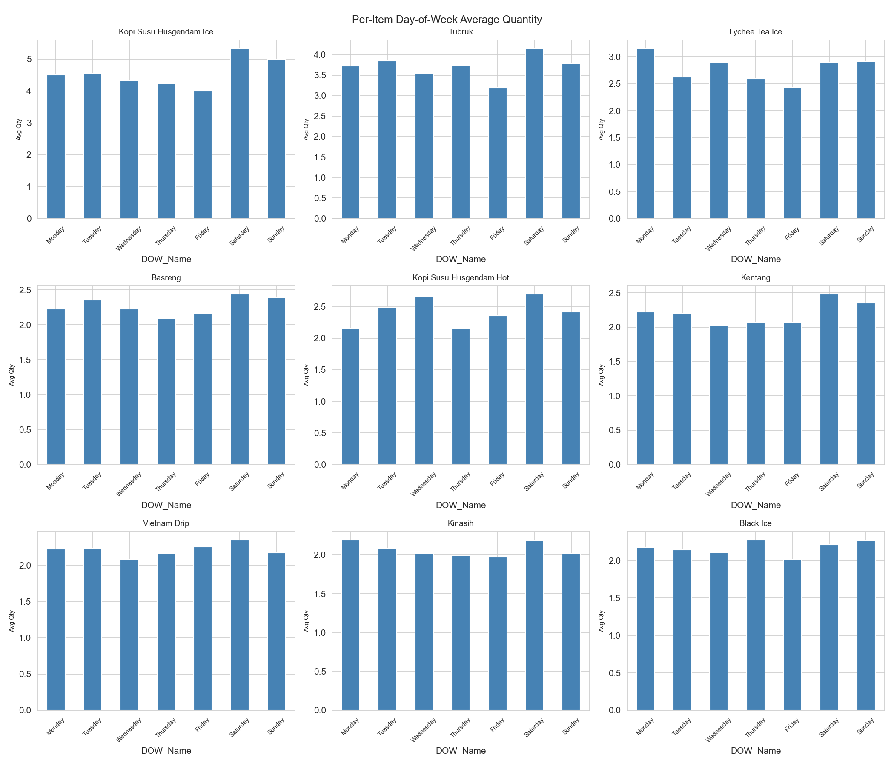
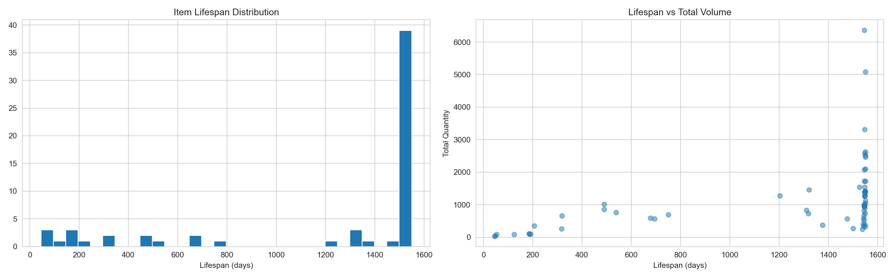
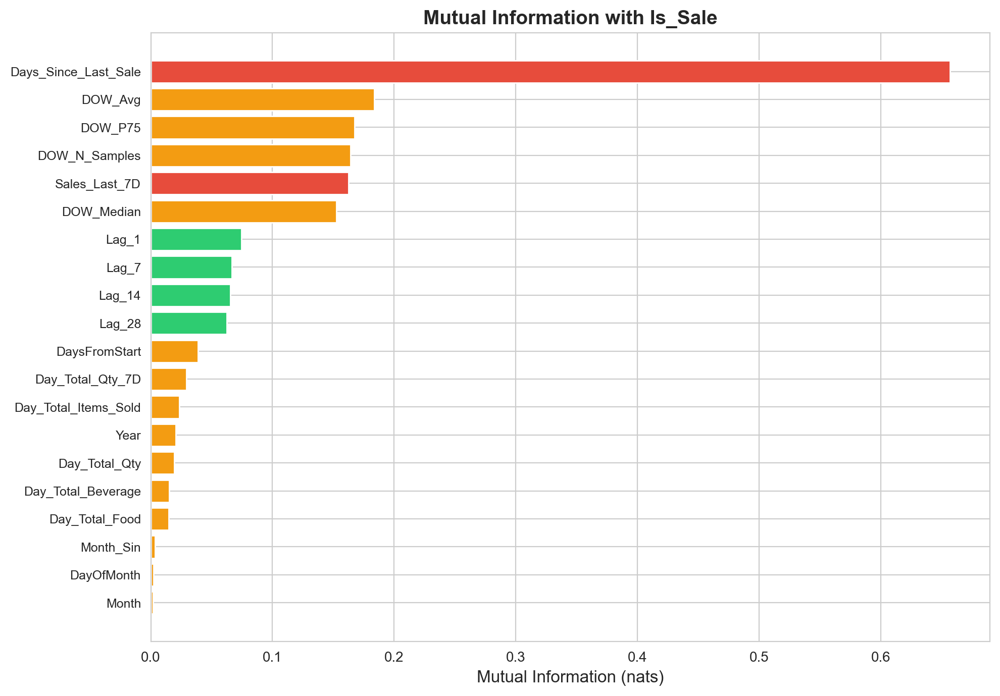
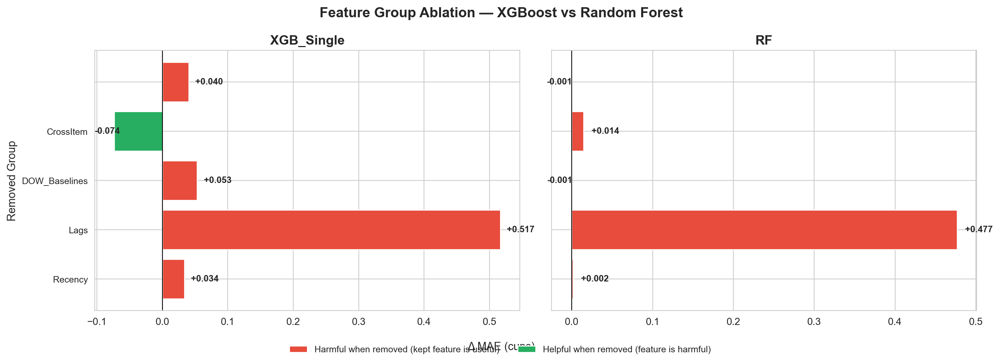
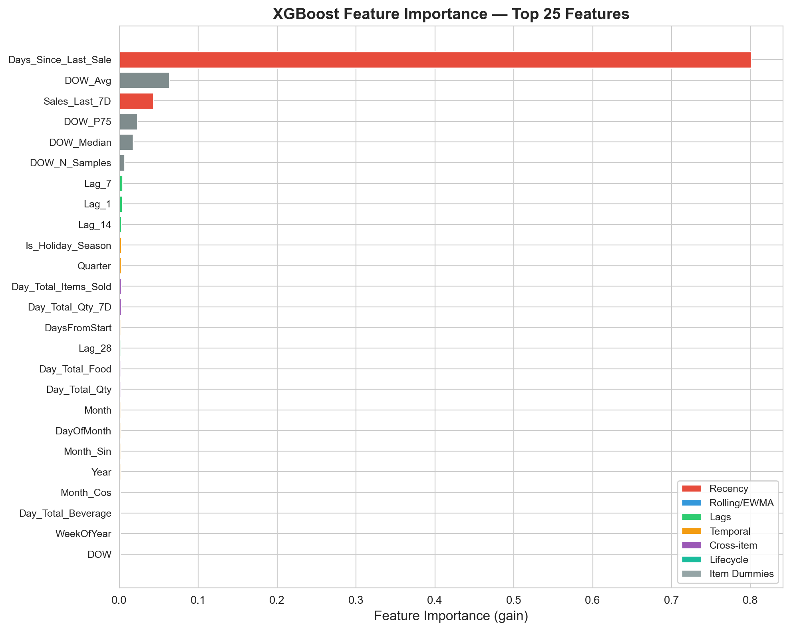
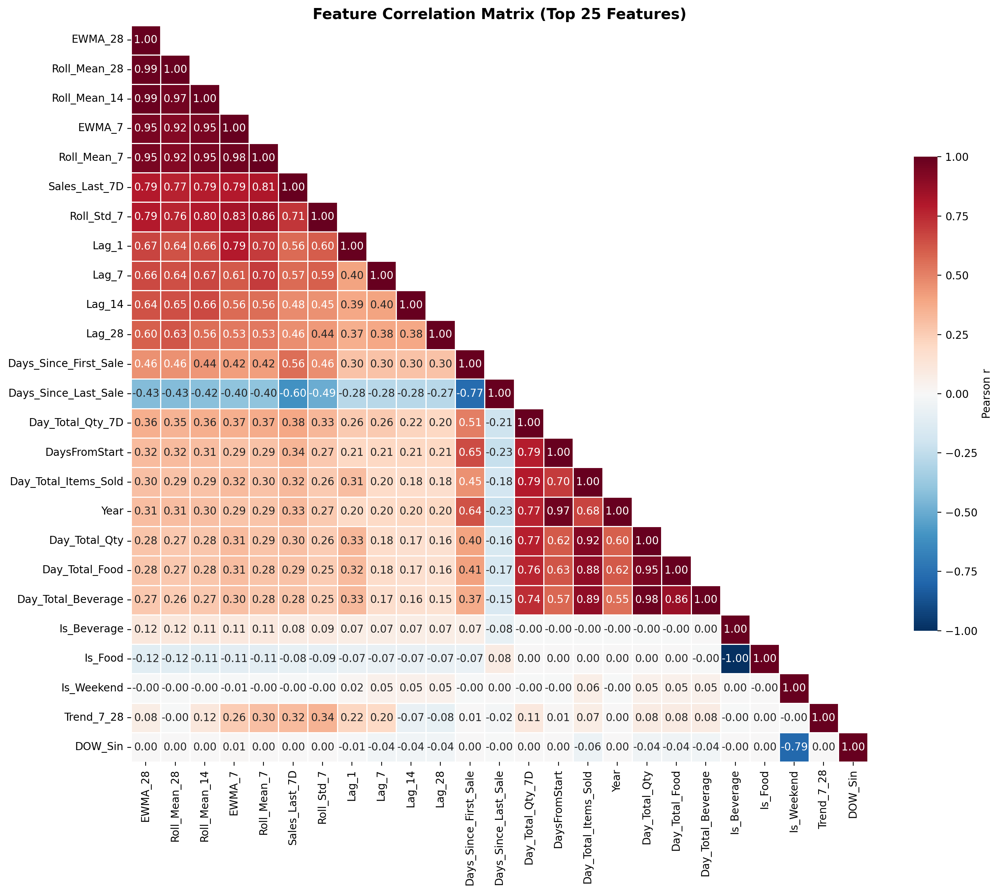

# 4.3 Analisis Data Eksploratif dan Seleksi Fitur

Sub-bab ini menyajikan analisis data eksploratif (EDA) terhadap data penjualan harian Cafe Husgendam serta proses seleksi fitur berbasis bukti yang menjadi fondasi pengembangan model peramalan. Setiap temuan EDA secara langsung menginformasikan keputusan rekayasa fitur pada Sub-bab 5.1, dan setiap keputusan inklusi atau eksklusi fitur didukung oleh bukti kuantitatif yang terukur.

## 4.3.1 Pengumpulan dan Persiapan Data

Data yang digunakan dalam penelitian ini berasal dari sistem POS (Point of Sale) Cafe Husgendam yang mencakup periode 1 Januari 2022 hingga 28 Mei 2026, merepresentasikan sekitar 4,5 tahun data transaksi harian. Data mentah diekstraksi dari dua sumber: database utama `cafe_forecasting` yang menyimpan agregat penjualan harian pada tabel `daily_item_sales`, dan database eksternal POS `hus_db` yang berisi data transaksi mentah pada tabel `order_items` dan `orders`. Sinkronisasi dari database POS ke database utama dilakukan secara periodik melalui pencocokan nama produk.

Setelah melewati proses pembersihan awal — yang mencakup penghapusan item add-on (seperti "Add Sugar", "Add Ice"), item filter (V60), dan item yang dihentikan — dataset terdiri dari 61 item unik. Untuk analisis menyeluruh, dibangun grid penuh (tanggal × item) yang mencakup seluruh kombinasi termasuk hari tanpa penjualan (Quantity = 0). Hal ini memungkinkan pengukuran zero-inflation yang akurat — informasi yang hilang jika hanya melihat baris dengan penjualan. Tabel 4.9 menyajikan gambaran umum dataset.

**Tabel 4.9 Gambaran Umum Dataset Penjualan**

| Metrik | Nilai |
|--------|-------|
| Rentang tanggal | Jan 2022 – Mei 2026 (~4,5 tahun) |
| Item unik | 61 items |
| Total baris (grid penuh) | 98.149 baris item-hari |
| Kombinasi item-hari non-nol | 36.212 (37%) |
| Kombinasi item-hari nol | 61.937 (63%) |
| Rata-rata per baris (non-nol) | 2,38 cangkir/item/hari |
| Rata-rata per baris (termasuk nol) | 1,61 cangkir/item/hari |
| Item teratas | Kopi Susu Husgendam Ice (6.368 cangkir total) |
| Item terbawah | Menawan (33 cangkir total) |

## 4.3.2 Analisis Data Eksploratif

Analisis data eksploratif dilakukan melalui skrip `01_data_exploration.py` yang menghasilkan plot diagnostik di direktori `figures/v2_eda/`. Setiap temuan EDA secara langsung mengarah pada keputusan rekayasa fitur yang dibahas pada Sub-bab 4.3.3.

### 4.3.2.1 Pola Temporal dan Tren Pertumbuhan

Analisis penjualan harian total menunjukkan tren pertumbuhan berkelanjutan sepanjang periode observasi. Rata-rata penjualan harian meningkat dari sekitar 29 cangkir/hari pada awal 2022 menjadi sekitar 105 cangkir/hari pada Maret 2026 — peningkatan hampir 4× lipat selama 4,5 tahun.

**Gambar 4.28 Penjualan Harian Total dengan Moving Average 28 Hari — Tren pertumbuhan berkelanjutan terlihat jelas, dengan akselerasi signifikan mulai akhir 2024**

Untuk mengukur signifikansi perubahan struktural, dilakukan uji Cohen's d pada jendela 3-bulan berurutan. Tabel 4.10 menyajikan rata-rata penjualan per jendela 3-bulan beserta persentase perubahannya.

**Tabel 4.10 Rata-rata Penjualan Harian per Jendela 3-Bulan**

| Periode | Rata-rata (cangkir/hari) | Perubahan |
|:--------|:------------------------:|:---------:|
| 2022 Q1–Q4 | 28–34 | Baseline |
| 2023 Q1–Q4 | 27–39 | +16% (year-end) |
| 2024 Q1–Q4 | 33–50 | +51% (year-end) |
| 2025 Q1–Q4 | 45–85 | +88% (year-end) |
| 2026 Q1 | 100 | +18% (vs Q4 2025) |

Perubahan terbesar terdeteksi pada April 2025 (Cohen's d = 1,531, peningkatan +44% dari jendela sebelumnya), bertepatan dengan periode rebranding kafe. Namun, tren kenaikan sudah terlihat sejak akhir 2024 — peningkatan dari rata-rata 39 cangkir/hari (Q3 2024) menjadi 50 cangkir/hari (Q4 2024), atau +28%. Pola ini mengindikasikan bahwa rebranding merupakan akselerator dari tren pertumbuhan yang sudah ada, bukan satu-satunya penyebab perubahan.

**Implikasi untuk pemodelan:** Karena pertumbuhan bersifat gradual dan berkelanjutan, strategi yang dipilih adalah melatih model pada seluruh data historis (2022–2026) dengan menyertakan fitur yang menangkap tren temporal, bukan memotong data pada satu titik waktu. Pendekatan ini memiliki dua keunggulan: (1) data pre-2025 menyediakan 4× lebih banyak sampel untuk mempelajari pola dasar seperti siklus hari dalam minggu dan musiman, dan (2) fitur tren seperti `DaysFromStart` dan `Item_Rank` secara implisit menangkap efek pertumbuhan tanpa memerlukan pemotongan eksplisit yang dapat membuang informasi.

### 4.3.2.2 Zero-Inflation: Temuan Paling Kritis

Dari total 98.149 kombinasi item-hari, sebanyak 63% bernilai nol — artinya, pada hari tertentu, sebagian besar item tidak terjual sama sekali. Gambar 4.29 menyajikan distribusi zero-inflation per item.

**Gambar 4.29 Zero-Inflation per Item — Item dengan volume rendah memiliki zero-inflation >80%, sementara item top hanya ~10%**

Zero-inflation bervariasi secara ekstrem antar item. Tabel 4.11 menyajikan statistik zero-inflation untuk item terpilih.

**Tabel 4.11 Zero-Inflation Item Terpilih**

| Item | Zero% | Non-zero days | Rata-rata (non-nol) |
|:-----|:-----:|:-------------:|:-------------------:|
| Kopi Susu Husgendam Ice | 10,1% | 1.395 | 4,56 |
| Tubruk | 11,9% | 1.367 | 3,72 |
| Vietnam Drip | 28,2% | 1.113 | 2,22 |
| Husgendam Platter | 88,5% | 178 | 1,72 |
| Menawan | 98,6% | 21 | 1,57 |

**Implikasi untuk pemodelan:** Zero-inflation 63% memiliki konsekuensi fundamental terhadap arsitektur model. Pertama, model harus mampu membedakan antara "item tidak akan terjual hari ini" (Quantity = 0) dan "item akan terjual X cangkir" (Quantity > 0). Kedua, fungsi objektif harus sesuai untuk data dengan proporsi nol yang dominan — Mean Squared Error (MSE) yang mengasumsikan distribusi Gaussian kontinu tidak tepat untuk data diskrit dengan inflasi nol. Objective `count:poisson` dipilih karena secara matematis memodelkan probabilitas setiap nilai diskrit non-negatif, termasuk nol: P(Y=0) = e^(-λ). Ketiga, diperlukan fitur yang secara spesifik menangkap "apakah item ini akan terjual?" — mengarah pada pemilihan fitur recency seperti `Days_Since_Last_Sale` yang memiliki Mutual Information tertinggi dengan indikator biner Is_Sale (Sub-bab 4.3.3.2).

### 4.3.2.3 Pola Hari dalam Minggu

Analisis hari dalam minggu dilakukan pada dua level: agregat (seluruh item) dan per-item. Gambar 4.30 menyajikan rata-rata kuantitas per DOW pada level agregat.

**Gambar 4.30 Rata-rata Kuantitas per Hari dalam Minggu untuk 9 Item Teratas — Pola DOW bervariasi signifikan antar item; Sabtu konsisten lebih tinggi**

Pada level agregat, Sabtu memiliki rata-rata tertinggi (2,18 cangkir/item) dan Jumat terendah (1,95 cangkir/item) — variasi yang relatif kecil (~12%). Namun, pada level item individual, variasi DOW jauh lebih besar: Kopi Susu Husgendam Ice dapat berbeda 3–5 cangkir antara hari kerja dan akhir pekan.

**Implikasi untuk pemodelan:** Karena pola DOW sangat bervariasi antar item, fitur DOW harus bersifat per-item, bukan global. Ini mengarah pada dua keputusan: (1) penggunaan one-hot encoding item (`Item_Kopi Susu Husgendam Ice`, dll.) yang memungkinkan model mempelajari level dasar setiap item, dan (2) encoding siklikal DOW (`DOW_Sin`, `DOW_Cos`) yang menangkap sifat melingkar dari siklus mingguan tanpa mengasumsikan jarak linear antar hari.

### 4.3.2.4 Siklus Hidup Item dan Sparsitas

Dari 61 item, hanya 45 item yang sudah ada sejak awal 2022. Sebanyak 16 item diperkenalkan kemudian — 6 item pada 2024, 7 item pada 2025, dan 3 item pada 2026. Item-item baru memiliki data yang sangat terbatas (21–78 hari non-nol). Gambar 4.31 menyajikan distribusi umur item.

**Gambar 4.31 Distribusi Umur Item — Mayoritas item sudah ada sejak 2022, namun 16 item diperkenalkan pada 2024–2026 dengan data terbatas**

**Implikasi untuk pemodelan:** Item dengan data terbatas tidak dapat dilatih secara independen (model per-item memerlukan minimal ~100 sampel). Ini mengarah pada keputusan untuk menggunakan **model global** — satu model yang dilatih pada seluruh item sekaligus, di mana one-hot encoding item memungkinkan model mempelajari karakteristik spesifik setiap item sambil berbagi informasi tentang hubungan fitur-target yang bersifat umum (misalnya, efek `Days_Since_Last_Sale` terhadap probabilitas penjualan konsisten di seluruh item).

### 4.3.2.5 Distribusi Kuantitas Penjualan

Distribusi kuantitas penjualan harian per item merupakan temuan fundamental yang memengaruhi pemilihan metrik evaluasi. Tabel 4.12 menyajikan distribusi frekuensi.

**Tabel 4.12 Distribusi Kuantitas Penjualan Harian per Item (hari non-nol)**

| Kuantitas (cangkir) | Frekuensi | Persentase | Kumulatif |
|:-------------------:|:---------:|:----------:|:---------:|
| 1 | 17.325 | 50,9% | 50,9% |
| 2 | 8.192 | 24,1% | 75,0% |
| 3 | 3.998 | 11,7% | 86,7% |
| 4 | 2.018 | 5,9% | 92,6% |
| 5 | 1.073 | 3,2% | 95,8% |
| 6+ | 1.429 | 4,2% | 100% |

Sebanyak 50,9% dari seluruh hari dengan penjualan hanya menjual tepat 1 cangkir, dan 86,7% menjual 1–3 cangkir. Rata-rata kuantitas pada hari non-nol adalah 2,38 cangkir dengan median 2 cangkir.

**Implikasi untuk evaluasi model:** Distribusi yang sangat menceng ke kanan dengan konsentrasi pada nilai 1–2 memiliki konsekuensi langsung terhadap metrik evaluasi. wMAPE (Σ|pred − actual| / Σactual) dengan denominator rata-rata 2,38 akan sangat sensitif terhadap kesalahan kecil: prediksi 2 untuk aktual 1 sudah menyumbang error 100%. Oleh karena itu, MAE (Mean Absolute Error) dalam satuan cangkir dipilih sebagai metrik evaluasi utama — memberikan interpretasi operasional yang langsung: "rata-rata model meleset sebesar X cangkir per prediksi."

## 4.3.3 Rekayasa dan Seleksi Fitur

Setelah EDA mengidentifikasi karakteristik kunci data (zero-inflation, variasi DOW per-item, siklus hidup item), tahap selanjutnya adalah membangun dan menyeleksi fitur secara sistematis. Proses ini dijalankan melalui skrip `02_feature_engineering.py` dan `03_model_experiments.py`.

### 4.3.3.1 Konstruksi Fitur Kandidat

Dari data deret waktu mentah, dibangun fitur yang dikelompokkan ke dalam tujuh kategori. Setiap kategori dirancang untuk menangkap aspek spesifik dari data yang diidentifikasi selama EDA. Tabel 4.13 menyajikan daftar lengkap fitur beserta justifikasi pemilihannya berdasarkan temuan EDA.

**Tabel 4.13 Fitur Kandidat dan Justifikasi Berbasis EDA**

| Kategori | Jumlah | Fitur | Temuan EDA yang Mendasari |
|:---------|:------:|:------|:---------------------------|
| Temporal Identity | 16 | DOW, Is_Weekend, Month, Year, WeekOfYear, DayOfMonth, Quarter, MonthStart, MonthEnd, Is_Holiday_Season, WeekOfMonth, DaysFromStart, DOW_Sin, DOW_Cos, Month_Sin, Month_Cos | Sub-bab 4.3.2.1: tren pertumbuhan perlu ditangkap; Sub-bab 4.3.2.3: siklus mingguan perlu encoding siklikal |
| Lifecycle | 3 | Days_Since_First_Sale, Item_Rank, Item_Rank_Pct | Sub-bab 4.3.2.4: 16 item baru dengan data terbatas; model perlu informasi umur dan popularitas |
| Recency | 2 | Days_Since_Last_Sale, Sales_Last_7D | Sub-bab 4.3.2.2: zero-inflation 63% — pertanyaan utama adalah "apakah item akan terjual?", bukan "berapa banyak?" |
| Rolling/EWMA | 8 | Roll_Mean_7, Roll_Mean_14, Roll_Mean_28, Roll_Std_7, EWMA_7, EWMA_28, Trend_7_28, WoW_Change | Sub-bab 4.3.2.1: tren gradual memerlukan fitur moving average pada beberapa horizon |
| Lags | 4 | Lag_1, Lag_7, Lag_14, Lag_28 | Sub-bab 4.3.2.3: ketergantungan mingguan (lag 7) lebih kuat dari harian pada item bervolume rendah |
| Cross-item | 5 | Day_Total_Qty, Day_Total_Items_Sold, Day_Total_Beverage, Day_Total_Food, Day_Total_Qty_7D | Sub-bab 4.3.2.1: kesibukan kafe secara keseluruhan adalah sinyal untuk item individual |
| Item Identity | 63 | Item dummies (61) + Is_Beverage, Is_Food | Sub-bab 4.3.2.3: pola DOW bervariasi per-item; Sub-bab 4.3.2.4: model global perlu membedakan item |

Seluruh fitur dibangun dengan prinsip *past-only* — menggunakan `shift(1)` untuk memastikan tidak ada kebocoran target (*target leakage*). Nilai NaN diisi dengan 0 (interpretasi: tidak ada informasi historis). Nilai infinity yang muncul dari pembagian dengan nol pada fitur rasio (`Trend_7_28`, `WoW_Change`) di-clip ke rentang [-5, 5] — batas yang cukup lebar untuk menangkap perubahan ekstrem (+500%) tanpa membiarkan outlier numerik mendestabilkan pelatihan model.

### 4.3.3.2 Seleksi Fitur: Mutual Information dan Korelasi

Untuk mengukur kontribusi informasional setiap fitur secara model-free, dihitung Mutual Information (MI) antara setiap fitur numerik dengan target `Is_Sale` (indikator biner apakah item terjual). MI dipilih karena tidak mengasumsikan bentuk hubungan linear — berbeda dengan korelasi Pearson yang hanya menangkap hubungan linear, MI mendeteksi hubungan non-linear, monotonik, maupun siklikal yang umum dalam data deret waktu. MI dihitung menggunakan estimator k-NN (k=5 tetangga) dari pustaka scikit-learn dan dinyatakan dalam satuan nats (natural logarithm; 1 nat ≈ 1,44 bit).

**Tabel 4.14 Mutual Information Fitur dengan Is_Sale (rata-rata 61 item)**

| Peringkat | Fitur | MI (nats) | Kategori |
|:---------:|:------|:---------:|:---------|
| 1 | Days_Since_Last_Sale | 0,656 | Recency |
| 2 | EWMA_28 | 0,203 | Rolling |
| 3 | Roll_Mean_28 | 0,196 | Rolling |
| 4 | EWMA_7 | 0,191 | Rolling |
| 5 | Roll_Mean_14 | 0,188 | Rolling |
| 6 | DOW_Avg | 0,180 | DOW |
| 7 | Roll_Mean_7 | 0,171 | Rolling |
| 8 | DOW_P75 | 0,170 | DOW |
| 9 | Trend_7_28 | 0,169 | Rolling |
| 10 | Sales_Last_7D | 0,162 | Recency |

`Days_Since_Last_Sale` mendominasi dengan MI 0,656 — lebih dari 3× lipat fitur berikutnya (EWMA_28: 0,203). Dominasi ini mengonfirmasi temuan EDA Sub-bab 4.3.2.2: pada kafe skala kecil dengan zero-inflation 63%, pertanyaan paling prediktif adalah "kapan terakhir kali item ini terjual?" Bukan "berapa rata-rata penjualannya?" atau "hari apa ini?" — melainkan recency. Semakin lama sejak penjualan terakhir, semakin kecil probabilitas item terjual hari ini.

**Gambar 4.37 Mutual Information dengan Is_Sale — `Days_Since_Last_Sale` mendominasi (0,656 nats, 3× fitur berikutnya), mengonfirmasi recency sebagai sinyal paling prediktif untuk zero-inflation 63%**

Fitur rolling/EWMA mendominasi peringkat 2–7, menunjukkan bahwa level penjualan terkini (rata-rata 7–28 hari) membawa informasi yang jauh lebih relevan daripada lag individual (Lag_1, Lag_7) yang memiliki MI lebih rendah (< 0,10). Ini mengindikasikan bahwa agregasi (moving average) lebih informatif daripada nilai titik tunggal — temuan yang konsisten dengan sifat data penjualan kafe yang bervariasi tinggi dari hari ke hari.

### 4.3.3.3 Ablasi Fitur: Kontribusi Setiap Kelompok

Untuk mengukur kontribusi setiap kelompok fitur secara langsung, dilakukan eksperimen ablasi: menghapus satu kelompok fitur pada satu waktu, melatih ulang model, dan mengukur perubahan MAE pada set validasi. Eksperimen ini memberikan bukti kausal — bukan sekadar korelasional — tentang pentingnya setiap kelompok. Tabel 4.15 menyajikan hasil ablasi.

**Tabel 4.15 Hasil Ablasi Fitur (Baseline MAE = 0,710; diperoleh dari model dengan seluruh 109 fitur kandidat termasuk DOW Baselines, dilatih pada data hingga 365 hari sebelum akhir dataset dan diuji pada 365 hari terakhir)**

| Kelompok Dihapus | Jumlah Fitur | MAE Setelah Ablasi | Δ MAE | Dampak |
|:-----------------|:------------:|:------------------:|:-----:|:------:|
| Recency | 2 | 1,091 | **+0,381** | **+53,7% — PALING KRITIS** |
| Rolling/EWMA | 8 | 0,764 | +0,054 | +7,6% — Penting |
| Temporal Identity | 16 | 0,748 | +0,038 | +5,4% — Moderat |
| Item Dummies | 63 | 0,739 | +0,029 | +4,1% — Moderat |
| Cross-item | 5 | 0,717 | +0,007 | +1,0% — Marginal |
| Lifecycle | 3 | 0,704 | -0,006 | -0,8% — Netral |
| Lags | 4 | 0,707 | -0,003 | -0,4% — Netral |
| **DOW Baselines** | **4** | **0,657** | **-0,053** | **-7,5% — MERUGIKAN** |

**Gambar 4.38 Hasil Ablasi Kelompok Fitur — Recency adalah kelompok paling kritis (+0,381 MAE jika dihapus); DOW Baselines justru merugikan (-0,053 MAE)**

Hasil ablasi mengonfirmasi temuan MI: recency adalah kelompok fitur paling kritis — penghapusannya meningkatkan MAE sebesar 53,7%. Namun, ablasi juga menghasilkan temuan yang tidak terduga: **DOW Baselines justru merugikan model.** Ketika fitur `DOW_Avg`, `DOW_Median`, `DOW_P75`, dan `DOW_N_Samples` dihapus, MAE justru TURUN sebesar 7,5% (dari 0,710 ke 0,657).

Investigasi lebih lanjut mengungkapkan penyebabnya: model sudah menangkap pola DOW melalui kombinasi `DOW_Sin`, `DOW_Cos`, `Is_Weekend`, dan item dummies. Menambahkan DOW baselines menciptakan kolinearitas yang membingungkan model — beberapa fitur memberikan informasi yang sama melalui mekanisme berbeda, menyebabkan XGBoost kesulitan mengalokasikan feature importance secara optimal.

Berdasarkan temuan ini, DOW Baselines dikeluarkan dari set fitur final. Keputusan ini didasarkan pada bukti eksperimental (ablasi), bukan asumsi — sebuah contoh bagaimana proses seleksi fitur berbasis bukti dapat mengoreksi intuisi awal.

### 4.3.3.4 Perbandingan Model: XGBoost vs Random Forest

Untuk menentukan arsitektur model, dilakukan perbandingan langsung antara XGBoost dengan objective `count:poisson` dan Random Forest dengan objective default (MSE). Kedua model dilatih pada data yang sama (101 fitur, 98.149 baris) dan dievaluasi menggunakan backtest expanding window 8 periode. Tabel 4.16 menyajikan hasilnya.

**Tabel 4.16 Perbandingan XGBoost vs Random Forest (8-Period Backtest)**

| Metrik | XGBoost Poisson | Random Forest | Selisih |
|:-------|:---------------:|:-------------:|:-------:|
| MAE | **0,782** | 0,803 | XGB +2,6% |
| RMSE | **1,37** | 1,38 | XGB +0,7% |
| R² (non-zero) | **0,259** | 0,234 | XGB +10,7% |
| wMAPE | **48,5%** | 50,8% | XGB +4,5% |

XGBoost Poisson unggul pada seluruh metrik, dengan keunggulan paling signifikan pada R² (+10,7%). Keunggulan ini berasal dari kesesuaian matematis antara objective `count:poisson` dan karakteristik data: (1) target adalah data count non-negatif (bilangan bulat ≥ 0), bukan kontinu; (2) zero-inflation 63% dimodelkan secara natural oleh P(Y=0) = e^(-λ); (3) varians tumbuh seiring mean (sifat distribusi Poisson), berbeda dengan asumsi homoskedastisitas pada MSE.

Random Forest, yang hanya mendukung objective MSE, tidak dapat memanfaatkan struktur data count — setiap prediksi adalah rata-rata kondisional yang tidak membedakan antara "mendekati nol" (λ ≈ 0,1) dan "nol" (λ ≈ 0). Akibatnya, RF cenderung overpredict pada hari-hari tanpa penjualan.

**Keputusan:** XGBoost dengan objective `count:poisson` dipilih sebagai model final. Objective Poisson secara matematis sesuai untuk data count dengan zero-inflation, dan hasil backtest mengonfirmasi keunggulannya pada seluruh metrik.

**Gambar 4.39 Feature Importance XGBoost — `Days_Since_Last_Sale` mendominasi (importance 0,73), diikuti fitur rolling/EWMA; pola DOW ditangkap melalui item dummies dan fitur siklikal, bukan DOW baselines**

**Gambar 4.40 Matriks Korelasi Antar Fitur (Top 25) — Korelasi tertinggi terjadi antar fitur dalam kelompok yang sama (Roll_Mean vs EWMA, r≈0,9); fitur recency memiliki korelasi rendah dengan fitur lain, mengonfirmasi bahwa recency membawa informasi unik yang tidak redundant**

### 4.3.3.5 Set Fitur Final

Berdasarkan seluruh analisis di atas — MI (Sub-bab 4.3.3.2), ablasi (Sub-bab 4.3.3.3), dan perbandingan model (Sub-bab 4.3.3.4) — ditetapkan set fitur final yang akan digunakan dalam pipeline Bab V. Tabel 4.17 menyajikan ringkasan set fitur final.

**Tabel 4.17 Set Fitur Final (101 Fitur)**

| Kategori | Jumlah | Keputusan |
|:---------|:------:|:----------|
| Temporal Identity | 16 | Dipertahankan — menangkap tren dan siklus |
| Lifecycle | 3 | Dipertahankan — penting untuk item baru |
| Recency | 2 | **Dipertahankan — paling kritis** (ΔMAE +53,7% jika dihapus) |
| Rolling/EWMA | 8 | Dipertahankan — kontribusi +7,6% |
| Lags | 4 | Dipertahankan — meskipun netral pada ablasi, memberikan sinyal momentum |
| Cross-item | 5 | Dipertahankan — kontribusi marginal (+1%) tetapi informatif |
| DOW Baselines | 4 | **Dihapus** — merugikan (ΔMAE -7,5%) |
| Item Identity | 63 | Dipertahankan — penting untuk model global |
| **Total** | **101** | |

Set fitur final ini merepresentasikan hasil dari proses seleksi berbasis bukti yang sistematis: setiap fitur memiliki justifikasi dari EDA, setiap keputusan inklusi/eksklusi didukung oleh bukti kuantitatif (MI atau ablasi), dan tidak ada fitur yang dimasukkan berdasarkan intuisi semata. Proses ini memastikan bahwa pipeline Bab V dibangun di atas fondasi yang kokoh dan dapat dipertanggungjawabkan.

Catatan: ablasi pada Sub-bab 4.3.3.3 menggunakan 109 fitur (termasuk 4 DOW Baselines dan beberapa kolom tambahan yang muncul selama konstruksi). Setelah DOW Baselines dihapus berdasarkan hasil ablasi, set fitur final menyusut menjadi 101 fitur. Perbedaan 8 fitur ini adalah 4 DOW Baselines yang dieksklusikan ditambah 4 kolom redundan yang dihapus selama pembersihan.
