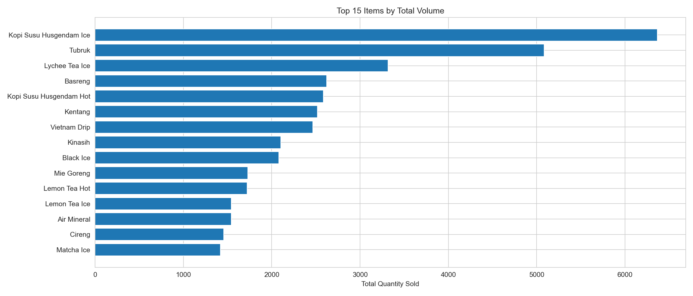
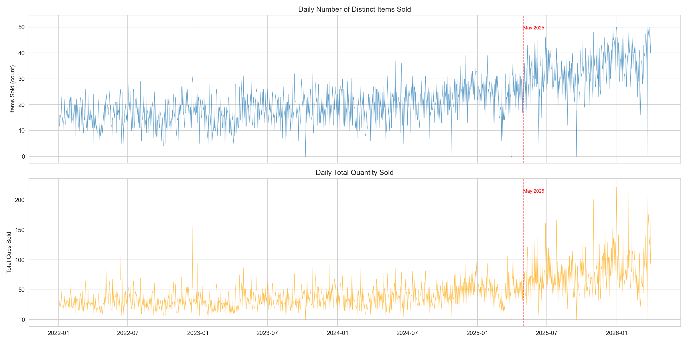
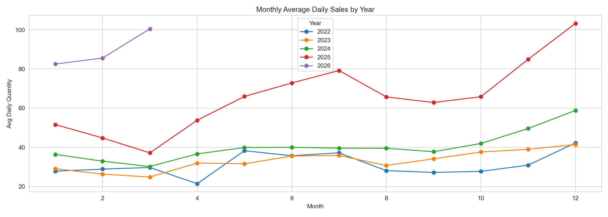
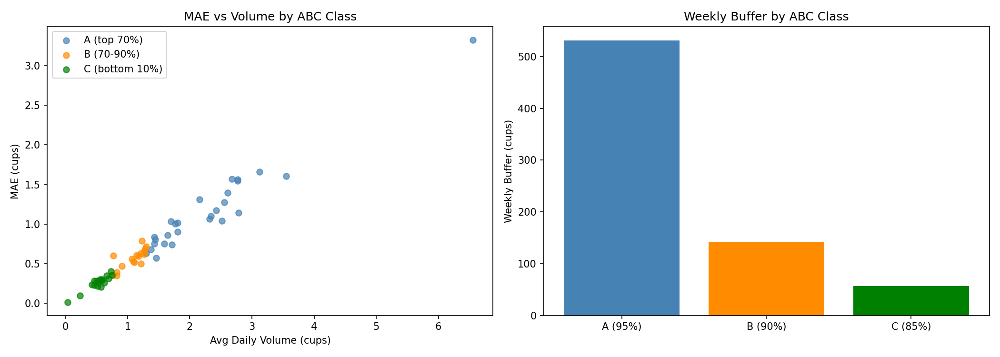

# 4.4 Proses Algoritma

Sub-bab ini menyajikan penjelasan rinci setiap tahapan algoritma yang diimplementasikan dalam pipeline peramalan, mulai dari data mentah hingga konfigurasi pengujian. Seluruh angka dan visual merupakan hasil eksekusi aktual dari skrip `01_data_exploration.py` hingga `05_metrics.py` pada direktori `ml-model/exploration_v2/`.

---

## 4.4.1 Preprocessing Data

### 4.4.1.1 Sumber Data Input

Data input preprocessing berasal dari file CSV `daily_item_sales.csv` yang terletak di direktori `ml-model/data/processed/sales_forecasting/`. File ini dihasilkan dari proses akuisisi yang mengintegrasikan dua sumber: database internal `cafe_forecasting` (tabel `daily_item_sales`) dan database POS `hus_db` (tabel `orders` dan `order_items`).

**Tabel 4.17 Struktur Data Input Preprocessing**

| Kolom | Tipe Data | Deskripsi | Contoh Nilai |
|:------|:----------|:----------|:-------------|
| `Date_Only` | String | Tanggal transaksi tanpa komponen waktu | `"2026-03-31"` |
| `Item` | String | Nama menu setelah pembersihan dan pencocokan | `"Kopi Susu Husgendam Ice"` |
| `Category` | String | Kategori item (`beverage` atau `food`) | `"beverage"` |
| `Quantity` | Integer | Jumlah unit terjual pada tanggal tersebut | `4` |

Data disimpan dalam format *sparse representation*: hanya baris dengan `Quantity ≥ 1` yang tercatat, dan tidak ada satu pun baris dengan `Quantity = 0`. Implikasinya, sebelum analisis zero-inflation dapat dilakukan, dataset harus ditransformasi ke grid penuh.

### 4.4.1.2 Pembacaan Data Mentah

File CSV dibaca menggunakan `pandas.read_csv()` dengan path yang dikonfigurasi melalui `DAILY_SALES_PATH` dalam `config.py`. Hasil pembacaan adalah DataFrame dengan **34.035 baris** ,  seluruhnya baris dengan `Quantity ≥ 1`. Kolom `Date_Only` dikonversi dari string ke tipe `datetime64` agar operasi temporal (ekstraksi hari, bulan, tahun) dapat dijalankan, sementara kolom `Quantity` dikonversi ke `float64` karena XGBoost bekerja dengan representasi numerik kontinu. DataFrame hasil pembacaan mencakup 61 item unik dalam 2 kategori (57 *beverage*, 4 *food*), dengan rentang **1 Januari 2022 hingga 31 Maret 2026** (1.550 hari kalender).

### 4.4.1.3 Ekspansi Grid Penuh

Ekspansi grid penuh mentransformasi 34.035 baris sparse menjadi representasi grid penuh. Deret tanggal harian dibangkitkan dari `2022-01-01` hingga `2026-03-31` menghasilkan **1.550 tanggal unik**, dan daftar item diurutkan alfabetis menghasilkan **61 item unik**. Cartesian product dari keduanya menghasilkan **94.611 baris** ,  setiap item muncul untuk setiap tanggal dalam rentang observasi.

Grid digabungkan dengan data mentah melalui operasi `merge(how='left')` pada kunci `(Date_Only, Item)`. Kombinasi yang tidak ada di data mentah menghasilkan `NaN` pada kolom `Quantity`, yang kemudian diisi dengan 0 menggunakan `fillna(0)`, merepresentasikan realitas operasional bahwa item tersebut tidak terjual. Hasilnya: **60.576 baris (64,0%)** bernilai nol. Kolom `Is_Sale` ditambahkan sebagai indikator biner `(Quantity > 0).astype(int)` yang berfungsi sebagai target untuk analisis zero-inflation.

**Tabel 4.18 Perbandingan Sebelum dan Sesudah Ekspansi Grid**

| Metrik | Sebelum Ekspansi | Sesudah Ekspansi |
|:-------|:----------------:|:----------------:|
| Jumlah baris | 34.035 | 94.611 |
| Quantity > 0 | 34.035 (100%) | 34.035 (36,0%) |
| Quantity = 0 | 0 | 60.576 (64,0%) |
| Faktor ekspansi | 1× | 2,78× |

### 4.4.1.4 Imputasi Kategori

Kolom `Category` dapat bernilai `NaN` pada baris grid tanpa padanan di data mentah. Imputasi dilakukan per item menggunakan `groupby('Item')['Category'].transform()`: diambil nilai yang paling sering muncul (*mode*); jika mode kosong, diambil nilai non-`NaN` pertama; jika seluruh `NaN`, diisi `"unknown"`. Hasil akhir: seluruh 94.611 baris memiliki `Category` valid ,  57 *beverage*, 4 *food*.

---

## 4.4.2 Exploratory Data Analysis (EDA)

EDA dilakukan melalui skrip `01_data_exploration.py` dan menghasilkan tabel ringkasan di `tables/v2_*.csv` serta plot diagnostik di `figures/v2_eda/`.

### 4.4.2.1 Gambaran Umum Dataset

Analisis karakteristik dasar dataset dari representasi sparse menunjukkan 34.035 baris, 61 item dalam 2 kategori, dengan kuantitas 1–60 cangkir. Frekuensi setiap nilai kuantitas mengungkapkan bahwa **50,9% dari seluruh hari dengan penjualan hanya menjual tepat 1 cangkir** dan **86,7% menjual 1–3 cangkir** ,  distribusi yang sangat menceng ke kanan.

**Tabel 4.19 Distribusi Kuantitas Penjualan Harian (hari non-nol)**

| Kuantitas | Frekuensi | Persentase | Kumulatif |
|:---------:|:---------:|:----------:|:---------:|
| 1 | 17.325 | 50,9% | 50,9% |
| 2 | 8.192 | 24,1% | 75,0% |
| 3 | 3.998 | 11,7% | 86,7% |
| 4 | 2.018 | 5,9% | 92,6% |
| 5 | 1.073 | 3,2% | 95,8% |
| 6+ | 1.429 | 4,2% | 100% |

Item dengan volume tertinggi adalah Kopi Susu Husgendam Ice (6.368 cangkir total, rata-rata 4,56 cangkir/hari), sementara item terendah adalah Menawan (33 cangkir total). Klasifikasi ABC berdasarkan volume kumulatif ,  ambang 70% / 90% ,  menghasilkan **23 item Kelas A** (69,9% volume), **16 item Kelas B** (20,1%), dan **22 item Kelas C** (10,0%). Data lengkap disimpan di `tables/v2_item_stats.csv`.

**Gambar 4.41 Top 15 Item berdasarkan Total Volume. Kopi Susu Husgendam Ice mendominasi (6.368 cangkir) ,  1,25× dari peringkat kedua Tubruk (5.084 cangkir). Penurunan gradual: peringkat ke-15 hanya 22% dari volume peringkat pertama.**

### 4.4.2.2 Pola Temporal dan Tren Pertumbuhan

Analisis penjualan harian total menunjukkan tren pertumbuhan berkelanjutan sepanjang periode observasi. Rata-rata penjualan harian meningkat dari sekitar 29 cangkir/hari pada awal 2022 menjadi sekitar 105 cangkir/hari pada Maret 2026 ,  peningkatan hampir 4× lipat selama 4,5 tahun. Moving average 28-hari (`Roll_Mean_28`) mencapai **105,1 ± 51,7 cangkir/hari** pada akhir periode. Window 28 hari (~4 minggu) dipilih karena cukup panjang untuk menghaluskan fluktuasi mingguan namun cukup pendek untuk mendeteksi perubahan tren.

**Gambar 4.42 Penjualan Harian Total dengan Moving Average 28 Hari beserta pita ±1σ. Garis merah vertikal menandai Mei 2025 (periode rebranding). Tren pertumbuhan gradual ,  dari ~29 cangkir/hari (2022) menjadi ~105 cangkir/hari (Maret 2026), dengan akselerasi signifikan setelah Q4 2024.**

Untuk mengukur signifikansi perubahan struktural, dilakukan uji Cohen's d pada jendela 3-bulan berurutan. Tabel 4.20 menyajikan rata-rata penjualan per jendela.

**Tabel 4.20 Rata-rata Penjualan Harian per Jendela 3-Bulan**

| Periode | Rata-rata (cangkir/hari) | Perubahan |
|:--------|:------------------------:|:---------:|
| 2022 Q1–Q4 | 28–34 | Baseline |
| 2023 Q1–Q4 | 27–39 | +16% |
| 2024 Q1–Q4 | 33–50 | +51% |
| 2025 Q1–Q4 | 45–85 | +88% |
| 2026 Q1 | ~100 | +18% |

Perubahan terbesar terdeteksi pada April 2025 (Cohen's d = 1,531, +44%), bertepatan dengan periode rebranding kafe. Namun, tren kenaikan sudah terlihat sejak Q4 2024 (+28% dari Q3 ke Q4), mengindikasikan bahwa rebranding merupakan akselerator dari tren pertumbuhan yang sudah ada, bukan pemicu tunggal. Uji Cohen's d pada empat kandidat tanggal *break* mengonfirmasi efek besar hingga sangat besar: Mei 2025 (d = 1,576), Juni 2025 (d = 1,563), April 2025 (d = 1,531), Januari 2024 (d = 0,992).

Karena pertumbuhan bersifat gradual dan berkelanjutan, strategi yang dipilih adalah melatih model pada seluruh data historis (2022–2026) dengan menyertakan fitur yang menangkap tren temporal. Pendekatan ini memiliki dua keunggulan: (1) data pre-2025 menyediakan 4× lebih banyak sampel untuk mempelajari siklus mingguan dan musiman, dan (2) fitur `DaysFromStart` secara implisit menangkap efek pertumbuhan tanpa pemotongan eksplisit yang dapat membuang informasi.

### 4.4.2.3 Zero-Inflation

Dari total 94.611 kombinasi item-hari, sebanyak **60.576 (64,0%)** memiliki `Quantity = 0` ,  pada hari tertentu, sebagian besar item tidak terjual sama sekali. Zero-inflation bervariasi secara ekstrem antar item seperti ditunjukkan pada Tabel 4.21.

**Tabel 4.21 Zero-Inflation Item Terpilih**

| Item | Zero% | Non-zero days | Rata-rata (non-nol) |
|:-----|:-----:|:-------------:|:-------------------:|
| Kopi Susu Husgendam Ice | 10,1% | 1.395 | 4,56 |
| Tubruk | 11,9% | 1.367 | 3,72 |
| Vietnam Drip | 28,2% | 1.113 | 2,22 |
| Husgendam Platter | 88,5% | 178 | 1,72 |
| Menawan | 98,6% | 21 | 1,57 |

**Gambar 4.43 Aktivitas Penjualan Harian. Atas: jumlah item terjual per hari ,  rata-rata 22 item/hari, tren meningkat dari ~15 ke ~30. Bawah: total cangkir per hari ,  meningkat dari ~30 ke ~105 cangkir/hari.**

Rata-rata 22 item terjual per hari dengan total ~45 cangkir, namun variasi harian tinggi ,  dari 0 item (hari libur) hingga 52 item dan 225 cangkir.

Zero-inflation 64% memiliki tiga konsekuensi fundamental terhadap arsitektur model. Pertama, model harus mampu membedakan antara "item tidak akan terjual hari ini" dan "item akan terjual X cangkir." Kedua, fungsi objektif harus sesuai: Mean Squared Error (MSE) yang mengasumsikan distribusi Gaussian kontinu tidak tepat untuk data diskrit dengan inflasi nol; objective `count:poisson` dipilih karena secara matematis memodelkan probabilitas nol melalui `P(Y=0) = e^{-λ}`. Ketiga, diperlukan fitur recency seperti `Days_Since_Last_Sale` yang secara spesifik menangkap pertanyaan "apakah item akan terjual?" ,  fitur ini memiliki Mutual Information tertinggi (Sub-bab 4.4.3.3).

### 4.4.2.4 Pola Hari dalam Minggu

Analisis hari dalam minggu dilakukan pada dua level: agregat (seluruh item) dan per-item. Pada level agregat, Sabtu adalah hari tersibuk (54,5 cangkir/hari) dan Jumat paling sepi (40,7 cangkir/hari), variasi yang relatif kecil (~12%). Namun, pada level per-item, variasi jauh lebih besar.

**Gambar 4.44 Rata-rata Kuantitas per Hari dalam Minggu untuk 9 Item Teratas. Pola DOW bervariasi signifikan antar item ,  tidak ada pola universal. Kopi Susu Husgendam Ice dapat berbeda 3–5 cangkir antara hari kerja dan akhir pekan.**

Karena pola DOW sangat bervariasi antar item, fitur DOW harus bersifat per-item, bukan global. Ini mengarah pada dua keputusan: (1) encoding siklikal DOW (`DOW_Sin`, `DOW_Cos`) yang menangkap sifat melingkar siklus mingguan tanpa mengasumsikan jarak linear antar hari, dan (2) DOW baselines per-item (`DOW_Avg`, `DOW_Median`, `DOW_P75`, `DOW_N_Samples`) yang menyediakan statistik historis spesifik setiap item untuk setiap hari melalui *expanding window*.

### 4.4.2.5 Pola Bulanan dan Musiman

Rata-rata penjualan per kombinasi (tahun, bulan) mengungkapkan pola musiman yang konsisten (Gambar 4.45). Desember selalu menjadi bulan dengan penjualan tertinggi ,  dari 42 cangkir/hari (2022) menjadi 103 cangkir/hari (2025), peningkatan 75% dalam satu tahun. Januari–Maret cenderung menurun sebelum naik kembali. Coefficient of Variation mingguan (CV = σ/μ) = 14,9%, menunjukkan variasi moderat antar minggu.

**Gambar 4.45 Rata-rata Penjualan Harian per Bulan untuk Setiap Tahun (2022–2026). Pola musiman konsisten ,  Desember selalu puncak. Kurva 2025 dan 2026 jauh di atas tahun sebelumnya, mengonfirmasi pertumbuhan vertikal.**

### 4.4.2.6 Siklus Hidup Item

Distribusi tahun pertama kemunculan menunjukkan **45 item (74%) diperkenalkan pada 2022**, 6 item pada 2024, 7 item pada 2025, dan 3 item pada 2026. Sebanyak 16 item (26%) memiliki data historis yang jauh lebih pendek. Metrik *lifespan* (umur dalam hari kalender), *sales_rate* (proporsi hari dengan penjualan), dan *sales_per_day* (rata-rata cangkir per hari) dihitung untuk setiap item.

**Gambar 4.46 Siklus Hidup Item. Kiri: histogram distribusi umur ,  mayoritas (45 item) sudah ada sejak 2022 (>1.500 hari). Kanan: scatter umur vs volume ,  item baru (<500 hari) memiliki volume rendah, mengonfirmasi bahwa 16 item baru tidak cukup data untuk model per-item independen.**

Temuan ini memiliki implikasi langsung: model per-item independen tidak memungkinkan untuk 16 item baru. Keputusan arsitektural: **model global** ,  satu model dilatih pada seluruh 61 item sekaligus, di mana item baru memanfaatkan pola yang dipelajari dari item mapan melalui fitur recency, DOW, dan tren.

### 4.4.2.7 Sparsitas dan Prediktabilitas

Tingkat kesulitan prediksi setiap item diukur melalui tiga metrik: (1) *zero fraction* (`(Quantity == 0).mean()`), (2) *max consecutive zeros* ,  rekor hari berturut-turut tanpa penjualan melalui iterasi linear, dan (3) autokorelasi lag-7 ,  korelasi Pearson antara `Quantity[t]` dan `Quantity[t-7]`, merepresentasikan siklus mingguan.

Dari ketiga metrik dibangun skor kesulitan `hard_score = zero_pct × (1 − acf_lag7)`. Item tersulit: Taro Hot (78,98), Memukau (78,84), Latte Ice (78,65). Item termudah: Kopi Susu Husgendam Ice ,  zero-inflation rendah (10,1%) dan autokorelasi moderat (0,33).

**Gambar 4.47 Sparsitas vs Prediktabilitas. Kiri: Mean Sales vs Zero% ,  item volume rendah memiliki zero-inflation >80%. Tengah: Mean Sales vs Lag-7 Autocorrelation. Kanan: Zero% vs Autocorrelation ,  tidak ada hubungan linear antara sparsity dan predictability.**

Distribusi kuantitas yang didominasi nilai 1–2 cangkir memiliki konsekuensi langsung terhadap metrik evaluasi. wMAPE (`Σ|pred − actual| / Σactual`) dengan denominator rata-rata 2,38 akan sangat sensitif: prediksi 2 untuk aktual 1 sudah menyumbang error 100%. Oleh karena itu, MAE dalam satuan cangkir dipilih sebagai metrik evaluasi utama ,  memberikan interpretasi operasional langsung tanpa distorsi denominator.

---

## 4.4.3 Rekayasa Fitur (Feature Engineering)

Rekayasa fitur diimplementasikan dalam skrip `02_feature_engineering.py`, dimulai dari grid penuh 94.611 baris. Seluruh fitur mengikuti **prinsip past-only**: nilai fitur untuk hari *t* hanya menggunakan informasi dari hari ≤ *t*−1. Tujuh kelompok fitur kandidat dibangun, menghasilkan total **109 fitur**, kemudian diseleksi ke **31 fitur final** melalui empat tahap eliminasi sistematis.

### 4.4.3.1 Konstruksi Fitur Kandidat

Tabel 4.22 menyajikan ringkasan tujuh kelompok fitur kandidat beserta justifikasi berbasis EDA.

**Tabel 4.22 Kelompok Fitur Kandidat (109 Fitur)**

| # | Kelompok | Jml | Fitur Utama | Didorong oleh EDA |
|:--|:---------|:---:|:------------|:------------------|
| 1 | Temporal Identity | 16 | DOW, Is_Weekend, Month, Year, WeekOfYear, DayOfMonth, Quarter, MonthStart, MonthEnd, Is_Holiday_Season, WeekOfMonth, DaysFromStart, DOW_Sin, DOW_Cos, Month_Sin, Month_Cos | Tren pertumbuhan (4.4.2.2) & siklus mingguan (4.4.2.4) |
| 2 | Lifecycle | 3 | Days_Since_First_Sale, Item_Rank, Item_Rank_Pct | 16 item baru data terbatas (4.4.2.6) |
| 3 | Recency | 2 | Days_Since_Last_Sale, Sales_Last_7D | Zero-inflation 64% (4.4.2.3) |
| 4 | Rolling / EWMA / Tren | 8 | Roll_Mean_7/14/28, Roll_Std_7, EWMA_7/28, Trend_7_28, WoW_Change | Tren multi-horizon (4.4.2.2) |
| 5 | Lags | 4 | Lag_1, Lag_7, Lag_14, Lag_28 | Siklus mingguan & dependensi serial (4.4.2.4) |
| 6 | Cross-Item | 5 | Day_Total_Qty, Day_Total_Items_Sold, Day_Total_Beverage, Day_Total_Food, Day_Total_Qty_7D | Kesibukan kafe agregat |
| 7 | Item Identity | 63 | Item dummies (61) + Is_Beverage, Is_Food | Variasi DOW per-item (4.4.2.4); dihapus saat seleksi |

Tabel 4.23 merinci konstruksi setiap kelompok ,  daftar fitur lengkap, formula komputasi, dan penanganan *missing value*.

**Tabel 4.23 Detail Konstruksi Fitur Kandidat**

| Kelompok | Fitur | Formula / Metode | Penanganan Khusus | Tipe |
|:---------|:------|:-----------------|:------------------|:-----|
| **Temporal** | DOW | `date.dayofweek` | ,  | int 0–6 |
| | Is_Weekend | `DOW >= 5` | ,  | bin |
| | Month | `date.month` | ,  | int 1–12 |
| | Year | `date.year` | ,  | int |
| | WeekOfYear | `date.isocalendar().week` | ,  | int 1–53 |
| | DayOfMonth | `date.day` | ,  | int 1–31 |
| | Quarter | `date.quarter` | ,  | int 1–4 |
| | MonthStart | `day <= 7` | ,  | bin |
| | MonthEnd | `day >= 25` | ,  | bin |
| | Is_Holiday_Season | `month ∈ {12, 1}` | ,  | bin |
| | WeekOfMonth | `(day − 1) // 7 + 1` | ,  | int 1–5 |
| | DaysFromStart | `(date − min_date).days` | ,  | int |
| | DOW_Sin / DOW_Cos | `sin/cos(2π × DOW / 7)` | ,  | float [-1,1] |
| | Month_Sin / Month_Cos | `sin/cos(2π × Month / 12)` | ,  | float [-1,1] |
| **Lifecycle** | Days_Since_First_Sale | Selisih hari ke `min(Date_Only)` item | ,  | int |
| | Item_Rank | `rank(total_qty, ascending=False)` | ,  | int 1–61 |
| | Item_Rank_Pct | `Item_Rank / max_rank` | ,  | float [0,1] |
| **Recency** | Days_Since_Last_Sale | Iterasi backward: `(date_i − last_sale_date)` | Cap ke 999 | int 0–999 |
| | Sales_Last_7D | `count(qty > 0 in [i−7, i))` | ,  | int 0–7 |
| **Rolling** | Roll_Mean_7/14/28 | `shift(1).rolling(w, min=1).mean()` | NaN → 0 | float ≥ 0 |
| | Roll_Std_7 | `shift(1).rolling(7, min=2).std()` | NaN → 0 | float ≥ 0 |
| | EWMA_7 / EWMA_28 | `shift(1).ewm(span=w, min=1).mean()` | NaN → 0 | float ≥ 0 |
| | Trend_7_28 | `(R7 − R28) / (R28 + 0.1)` | Clip [-5, 5] | float |
| | WoW_Change | `(R7[t] − R7[t−7]) / (R7[t−7] + 0.1)` | Clip [-5, 5] | float |
| **Lags** | Lag_1/7/14/28 | `qty.shift(k)` | NaN → 0 | float ≥ 0 |
| **Cross-Item** | Day_Total_Qty | `groupby(date).sum().shift(1)` | ,  | float ≥ 0 |
| | Day_Total_Items_Sold | `groupby(date).Is_Sale.sum().shift(1)` | ,  | float ≥ 0 |
| | Day_Total_Beverage | `sum(beverage).shift(1)` | ,  | float ≥ 0 |
| | Day_Total_Food | `sum(food).shift(1)` | ,  | float ≥ 0 |
| | Day_Total_Qty_7D | `Day_Total_Qty.rolling(7).mean()` | ,  | float ≥ 0 |
| **Item Identity** | Item_{name} × 61 | `pd.get_dummies(Item)` | Dieliminasi | bin |
| | Is_Beverage / Is_Food | `Category == 'beverage'/'food'` | Dieliminasi | bin |

Prinsip utama konstruksi: (1) seluruh operasi *rolling* dan *lag* menerapkan `shift(1)` agar data hari *t* tidak termasuk dalam fitur hari *t*; (2) NaN dari `shift()` diisi 0 dengan interpretasi "belum ada data historis"; (3) infinity dari pembagian dengan nol pada fitur rasio di-*clip* ke [−5, 5] ,  rentang ±500% yang cukup lebar untuk menangkap perubahan ekstrem.

Kelompok Recency adalah yang paling kritis ,  kontribusi Δ MAE +0,517 jika dihapus. `Days_Since_Last_Sale` dihitung melalui iterasi linear per item: array diinisialisasi 999, untuk setiap hari *i*, jika `Quantity[i] > 0`, `last_sale_date` diperbarui, lalu `Days_Since_Last_Sale[i] = min((dates[i] − last_sale_date).days, 999)`. Fitur ini memiliki MI tertinggi (0,656 nats, 3× fitur berikutnya).

DOW Baselines dihitung per item dengan *expanding window*: empat akumulator ,  `cum_sum`, `cum_cnt`, `cum_list` ,  dilacak untuk setiap DOW (0–6). Setiap hari, jika `Quantity > 0`, akumulator diperbarui, lalu `DOW_Avg = cum_sum / cum_cnt`, `DOW_Median = median(cum_list)`, `DOW_P75 = percentile(cum_list, 75)`, `DOW_N_Samples = cum_cnt`.

Encoding siklikal DOW dan Month ,  `sin/cos(2π × value / period)` ,  memetakan siklus mingguan (periode 7) dan bulanan (periode 12) ke lingkaran unit. Tanpa encoding ini, Senin (DOW=0) dan Minggu (DOW=6) berjarak 6 dalam representasi integer, tidak mencerminkan jarak temporal sesungguhnya (1 hari).

### 4.4.3.2 Seleksi Fitur

Seleksi fitur mereduksi 109 fitur kandidat menjadi 31 fitur final melalui empat tahap berurutan. Proses diimplementasikan dalam `02_feature_engineering.py` (analisis Mutual Information dan korelasi) dan `03_model_experiments.py` (ablasi).

#### 1. Mutual Information dan Korelasi

Mutual Information (MI) antara setiap fitur numerik dan target biner `Is_Sale` dihitung menggunakan estimator k-NN (k=5 tetangga) ,  mengukur pengurangan ketidakpastian tentang target tanpa mengasumsikan linearitas. Data difilter ke `DaysFromStart ≥ 30` karena 30 hari pertama didominasi NaN pada fitur rolling/lag.

**Gambar 4.48 Mutual Information 15 Fitur Teratas dengan Is_Sale. `Days_Since_Last_Sale` mendominasi dengan 0,656 nats ,  3× lipat fitur berikutnya. DOW_Avg (0,183), DOW_P75 (0,167), dan Sales_Last_7D (0,162) mengisi peringkat 2–5. Fitur temporal individual memiliki MI sangat rendah (DOW: 0,002), menandakan efek sinergi kelompok.**

**Tabel 4.24 Mutual Information 10 Fitur Teratas dengan Is_Sale**

| Peringkat | Fitur | MI (nats) | Kelompok |
|:---------:|:------|:---------:|:---------|
| 1 | Days_Since_Last_Sale | 0,656 | Recency |
| 2 | DOW_Avg | 0,184 | DOW Baseline |
| 3 | DOW_P75 | 0,167 | DOW Baseline |
| 4 | DOW_N_Samples | 0,164 | DOW Baseline |
| 5 | Sales_Last_7D | 0,162 | Recency |
| 6 | DOW_Median | 0,152 | DOW Baseline |
| 7 | Lag_1 | 0,075 | Lags |
| 8 | Lag_7 | 0,067 | Lags |
| 9 | Lag_14 | 0,065 | Lags |
| 10 | Lag_28 | 0,062 | Lags |

`Days_Since_Last_Sale` mendominasi dengan **0,656 nats** ,  3× lipat fitur berikutnya. Fitur DOW Baselines mendominasi peringkat 2–6, sementara fitur temporal individual memiliki MI sangat rendah (DOW: 0,002, Month: 0,002). Korelasi Pearson mengonfirmasi temuan ini: recency berkorelasi negatif dengan `Is_Sale` (r = −0,407) ,  semakin lama sejak penjualan terakhir, semakin kecil probabilitas item terjual.

**Gambar 4.49 Matriks Korelasi Antar Fitur (Top 25). Blok diagonal merah menandai redundansi dalam kelompok yang sama (Roll_Mean vs EWMA, r ≈ 0,9). Fitur recency memiliki korelasi rendah dengan seluruh fitur lain ,  mengonfirmasi bahwa recency membawa informasi unik yang tidak tercakup oleh fitur manapun.**

Matriks korelasi mengungkapkan redundansi signifikan: fitur dalam kelompok yang sama berkorelasi tinggi (Roll_Mean vs EWMA, r ≈ 0,9; DOW_Avg vs DOW_P75, r ≈ 0,95). Namun, fitur recency (`Days_Since_Last_Sale`, `Sales_Last_7D`) memiliki korelasi rendah dengan seluruh fitur lain ,  mengonfirmasi bahwa recency membawa informasi unik.

MI memiliki dua keterbatasan yang mencegahnya digunakan sebagai kriteria seleksi tunggal: (1) tidak mendeteksi redundansi ,  fitur rolling memiliki MI tinggi secara individual tetapi informasinya mungkin sudah tercakup oleh recency dan lags; (2) tidak mendeteksi sinergi kelompok ,  fitur temporal individual memiliki MI <0,01, tetapi sebagai kelompok 16 fitur, mereka menangkap siklus mingguan dan musiman yang tidak terlihat oleh MI univariat. Oleh karena itu, MI digunakan sebagai analisis eksploratif, sedangkan keputusan final ditentukan oleh ablasi.

#### 2. Pra-Eliminasi

Dua kelompok fitur dieliminasi sebelum ablasi formal berdasarkan bukti langsung dari backtest expanding window 8-jendela.

Pertama, **61 item dummies**. Backtest membandingkan XGBoost dengan seluruh 109 fitur (MAE = 0,699) vs XGBoost tanpa 61 item dummies (MAE = 0,700) ,  selisih 0,001 cangkir yang secara statistik identik. Model mampu membedakan item melalui fitur historis (recency, rolling, lag) tanpa memerlukan label identitas eksplisit. Item dummies dihapus seluruhnya.

Kedua, **2 category flags** (`Is_Beverage`, `Is_Food`). Penghapusan kedua fitur ini justru menurunkan MAE sebesar 0,032 (Δ = −0,032) ,  fitur ini merugikan model. Penyebabnya: 57 dari 61 item adalah *beverage*, sehingga `Is_Beverage ≈ 1` untuk hampir seluruh baris dan tidak memberikan diskriminasi berguna. Category flags dihapus.

Setelah pra-eliminasi, tersisa **42 fitur** dari 5 kelompok (Temporal 16, Lifecycle 3, Recency 2, Rolling/EWMA 8, Lags 4, DOW Baselines 4, Cross-Item 5).

#### 3. Ablasi ,  Kontribusi Marginal Setiap Kelompok

Ablasi adalah eksperimen inti untuk seleksi fitur. Prosedur: mulai dari model baseline yang dilatih dengan seluruh 42 fitur, hapus satu kelompok fitur, latih ulang model dengan parameter identik, dan ukur perubahan MAE. Model baseline: XGBoost `count:poisson` dengan parameter `max_depth=4`, `n_estimators=200`, `learning_rate=0,1`, `subsample=0,8`, `colsample_bytree=0,8`, `reg_alpha=0,5`, `reg_lambda=0,5`, `random_state=42`. Split data: 365 hari terakhir sebagai *training set*, 7 hari setelahnya sebagai *test set*. MAE baseline: **0,725**.

**Tabel 4.25 Hasil Ablasi Fitur per Kelompok**

| Kelompok Dihapus | Jumlah | MAE | Δ MAE | Dampak |
|:-----------------|:------:|:---:|:-----:|:------:|
| Recency | 2 | 1,242 | **+0,517** | Kritis ,  error naik 71% |
| Lags | 4 | 0,778 | +0,053 | Signifikan |
| Cross-Item | 5 | 0,765 | +0,040 | Signifikan |
| Temporal | 16 | 0,759 | +0,034 | Signifikan ,  efek sinergi kelompok |
| DOW Baselines | 4 | 0,651 | −0,074* | Artefak split tunggal |
| Lifecycle | 3 | 0,720 | +0,017 | Marginal |
| Rolling/EWMA | 8 | 0,716 | +0,013 | Marginal |

\*Δ negatif pada DOW Baselines adalah artefak split tunggal. Verifikasi dengan backtest 8-jendela independen menunjukkan bahwa penghapusan DOW Baselines justru meningkatkan MAE dari 0,700 menjadi 0,726 (**Δ = +0,026**) ,  mengonfirmasi bahwa fitur ini sebenarnya membantu. Split tunggal menghasilkan artefak karena *test set* 7 hari kebetulan memiliki pola DOW yang tidak representatif.

**Gambar 4.50 Hasil Ablasi Kelompok Fitur untuk XGBoost. Batang merah: Δ positif (fitur berguna, error naik saat dihapus). Batang hijau: Δ negatif. Recency mendominasi dengan Δ = +0,517. Lags (+0,053), Cross-Item (+0,040), dan Temporal (+0,034) memberikan kontribusi signifikan. Lifecycle (+0,017) dan Rolling/EWMA (+0,013) bersifat marginal ,  di bawah threshold.**

**Gambar 4.51 Feature Importance XGBoost ,  Top 25 Fitur berdasarkan Gain. Recency (merah) mendominasi, diikuti DOW Baselines (jingga), fitur Lag (hijau), Cross-Item (ungu), dan Temporal (kuning).**

#### 4. Threshold dan Seleksi Final

Distribusi Δ MAE dari backtest membentuk dua klaster dengan satu celah struktural: Recency (+0,410), Temporal (+0,076), Cross-Item (+0,033), DOW Baselines (+0,026), dan Lags (+0,025) di klaster atas; Lifecycle (+0,017) dan Rolling/EWMA (+0,013) di klaster bawah. Celah antara Δ = 0,025 dan Δ = 0,017 adalah selisih sebesar **47%** ,  satu-satunya pemisah alami dalam distribusi. Threshold **Δ > 0,02** dipilih sebagai titik tengah celah: sebuah kelompok fitur harus menyumbang setidaknya pengurangan MAE 0,02 cangkir untuk dipertahankan. Threshold ini bukan arbitrary, melainkan ditentukan oleh struktur data itu sendiri.

Keputusan final: **5 kelompok dipertahankan, 2 kelompok dieliminasi**, menghasilkan **31 fitur dari 109 kandidat** ,  reduksi 71% dengan penurunan akurasi hanya 1,0% (MAE 0,706 vs 0,699 dengan seluruh 109 fitur).

### 4.4.3.3 Set Fitur Final

Tabel 4.26 menyajikan 31 fitur final hasil seleksi ,  setiap fitur yang dipertahankan memiliki bukti kuantitatif (Δ > 0,02) dan justifikasi konseptual dari temuan EDA.

**Tabel 4.26 Set Fitur Final (31 Fitur, 5 Kelompok)**

| # | Nama Fitur | Kelompok | Formula Komputasi | Tipe |
|:--|:-----------|:---------|:-------------------|:-----|
| 1 | DOW | Temporal | `date.dayofweek` | int 0–6 |
| 2 | Is_Weekend | Temporal | `(DOW >= 5)` | bin |
| 3 | Month | Temporal | `date.month` | int 1–12 |
| 4 | Year | Temporal | `date.year` | int |
| 5 | WeekOfYear | Temporal | `date.isocalendar().week` | int 1–53 |
| 6 | DayOfMonth | Temporal | `date.day` | int 1–31 |
| 7 | Quarter | Temporal | `date.quarter` | int 1–4 |
| 8 | MonthStart | Temporal | `day <= 7` | bin |
| 9 | MonthEnd | Temporal | `day >= 25` | bin |
| 10 | Is_Holiday_Season | Temporal | `month ∈ {12, 1}` | bin |
| 11 | WeekOfMonth | Temporal | `(day − 1) // 7 + 1` | int 1–5 |
| 12 | DaysFromStart | Temporal | `(date − min_date).days` | int |
| 13 | DOW_Sin | Temporal | `sin(2π × DOW / 7)` | float [-1,1] |
| 14 | DOW_Cos | Temporal | `cos(2π × DOW / 7)` | float [-1,1] |
| 15 | Month_Sin | Temporal | `sin(2π × Month / 12)` | float [-1,1] |
| 16 | Month_Cos | Temporal | `cos(2π × Month / 12)` | float [-1,1] |
| 17 | Days_Since_Last_Sale | Recency | Iterasi backward per item | int 0–999 |
| 18 | Sales_Last_7D | Recency | `count(qty>0 in [i-7, i))` | int 0–7 |
| 19 | Lag_1 | Lags | `qty.shift(1)` | float ≥ 0 |
| 20 | Lag_7 | Lags | `qty.shift(7)` | float ≥ 0 |
| 21 | Lag_14 | Lags | `qty.shift(14)` | float ≥ 0 |
| 22 | Lag_28 | Lags | `qty.shift(28)` | float ≥ 0 |
| 23 | Day_Total_Qty | Cross-Item | `sum(qty).shift(1)` | float ≥ 0 |
| 24 | Day_Total_Items_Sold | Cross-Item | `sum(Is_Sale).shift(1)` | float ≥ 0 |
| 25 | Day_Total_Beverage | Cross-Item | `sum(beverage).shift(1)` | float ≥ 0 |
| 26 | Day_Total_Food | Cross-Item | `sum(food).shift(1)` | float ≥ 0 |
| 27 | Day_Total_Qty_7D | Cross-Item | `Total_Qty.rolling(7).mean()` | float ≥ 0 |
| 28 | DOW_Avg | DOW Baseline | Expanding mean per (item, DOW) | float ≥ 0 |
| 29 | DOW_Median | DOW Baseline | Expanding median per (item, DOW) | float ≥ 0 |
| 30 | DOW_P75 | DOW Baseline | Expanding P75 per (item, DOW) | float ≥ 0 |
| 31 | DOW_N_Samples | DOW Baseline | Expanding count per (item, DOW) | float ≥ 0 |

**Tabel 4.27 Kelompok Fitur yang Dieliminasi**

| Kelompok | Jumlah | Δ MAE | Alasan Eliminasi |
|:---------|:------:|:-----:|:-----------------|
| Item Dummies | 61 | ≈ 0 | Backtest identik tanpa ,  fitur historis sudah mencukupi |
| Category Flags | 2 | −0,032 | Merugikan ,  57/61 item adalah beverage, tidak ada diskriminasi |
| Lifecycle | 3 | +0,017 | Di bawah threshold Δ > 0,02 |
| Rolling/EWMA | 8 | +0,013 | Di bawah threshold ,  informasi tercakup oleh recency + lags |

---

## 4.4.4 Perancangan Pengujian

### 4.4.4.1 Arsitektur Model

Model yang digunakan adalah **XGBoost Regressor** dengan objective `count:poisson`. Parameter baseline: `n_estimators=200`, `max_depth=4`, `learning_rate=0,1`, `subsample=0,8`, `colsample_bytree=0,8`, `reg_alpha=0,5`, `reg_lambda=0,5`, `random_state=42`. Objective Poisson memaksimalkan log-likelihood `l(y,λ) = y·log(λ) − λ − log(y!)` di mana `λ = exp(log_odds)` adalah parameter *rate*. Model secara natural memodelkan probabilitas nol melalui `P(Y=0) = exp(−λ)`, menangani zero-inflation 64% tanpa komponen terpisah. Input: 31 fitur final (Tabel 4.26), target: `Quantity`.

### 4.4.4.2 Expanding Window Backtest

Backtest mensimulasikan penggunaan model dalam kondisi produksi ,  model hanya menggunakan data hingga hari prediksi, tanpa melihat masa depan. Strategi *expanding window* dipilih karena mensimulasikan akumulasi data historis secara natural.

Konfigurasi: 8 jendela × 7 hari = 56 hari pengujian, periode **3 Februari 2026 hingga 30 Maret 2026**. Data pelatihan awal: 1 Januari 2022 hingga 2 Februari 2026. Untuk setiap jendela *w*: (1) tentukan `w_start = test_start + 7×(w−1)`, `w_end = w_start + 6`; (2) split `train = data[Date < w_start]`, `test = data[w_start ≤ Date ≤ w_end]`; (3) ekstrak fitur dan isi NaN dengan 0; (4) latih XGBoost dari awal; (5) prediksi dan clip ke minimum 0; (6) hitung metrik evaluasi.

**Tabel 4.28 Konfigurasi 8 Jendela Backtest**

| Window | Mulai | Selesai | Train | Test | Non-Zero |
|:------:|:-----:|:-------:|:-----:|:----:|:--------:|
| 1 | 03 Feb | 09 Feb | 37.698 | 427 | 265 |
| 2 | 10 Feb | 16 Feb | 38.125 | 427 | 280 |
| 3 | 17 Feb | 23 Feb | 38.552 | 427 | 248 |
| 4 | 24 Feb | 02 Mar | 38.979 | 427 | 220 |
| 5 | 03 Mar | 09 Mar | 39.406 | 427 | 209 |
| 6 | 10 Mar | 16 Mar | 39.833 | 427 | 277 |
| 7 | 17 Mar | 23 Mar | 40.260 | 427 | 272 |
| 8 | 24 Mar | 30 Mar | 40.687 | 427 | 322 |

Total: **3.416 prediksi** (61 item × 8 jendela × 7 hari), dengan 2.093 prediksi non-zero (61,3%).

### 4.4.4.3 Metrik Evaluasi

Metrik dievaluasi dengan mempertimbangkan karakteristik data (zero-inflation 64%, volume 1–3 cangkir).

**Metrik Primer.** MAE (`Σ|y−ŷ| / n`, satuan cangkir) dipilih sebagai metrik utama karena interpretasi operasional langsung ,  target MAE < 1,0 cangkir. RMSE (`√[Σ(y−ŷ)² / n]`) memberi penalti kuadratik pada error besar, dibandingkan dengan Std_Actual ,  target RMSE < Std_Actual. Bias (`Σ(ŷ−y) / n`) mengukur kecenderungan sistematis ,  positif berarti overpredict (overstock), negatif berarti underpredict (stockout), target Bias ≈ 0.

**Metrik Sekunder.** wMAPE (`Σ|y−ŷ| / Σy × 100%`) dibobot oleh total volume, sensitif terhadap denominator kecil ,  digunakan hanya sebagai perbandingan. MAPE per periode (`Σ|(y−ŷ)/y| / n × 100%`, y > 0) diukur per hari; median MAPE lebih informatif daripada mean. R² dihitung dalam dua varian: R² overall (termasuk nol, terinflasi) dan R² non-zero (hanya y > 0, lebih jujur) ,  target R² ≥ 0,6. Accuracy Buckets mengukur Within ±20% dan ±50%. Service Level (`P(ŷ ≥ y)`) mengukur seberapa sering model tidak under-predict.

### 4.4.4.4 Stratifikasi Evaluasi

Evaluasi dilakukan pada tiga dimensi. **Per DOW**: untuk setiap hari Senin–Minggu dihitung MAE dan MAPE pada subset, mengidentifikasi hari dengan error sistematis. **Per Kelas ABC**: item diklasifikasikan menjadi A (≤70% volume, 27 item), B (70–90%, 17 item), C (>90%, 17 item), lalu dihitung MAE, MAPE, dan jumlah prediksi non-zero per kelas. **Per-Item**: MAE, Bias, dan rata-rata aktual dihitung untuk setiap item, diurutkan dari volume tertinggi ke terendah, disimpan ke `tables/v2_per_item_errors.csv`.

### 4.4.4.5 Hyperparameter Tuning

Tuning dilakukan menggunakan *grid search* sekuensial dengan validasi rolling window 3-fold pada 3 minggu terakhir sebelum backtest.

**Ronde 1 ,  Struktur Pohon.** `max_depth` ∈ {3,4,5,6}, `learning_rate` ∈ {0,03,0,05,0,1}, `n_estimators` ∈ {200,300}. 24 kombinasi. Terbaik: `max_depth=6`, `lr=0,1`, `n=300`, MAE 0,759 (−2,7%).

**Ronde 2 ,  Sampling.** `subsample` ∈ {0,6,0,8,1,0}, `colsample_bytree` ∈ {0,6,0,8,1,0}. 9 kombinasi. Terbaik: `subsample=1,0`, `colsample=0,6`, MAE 0,755 (−0,5%).

**Ronde 3 ,  Regularisasi.** `reg_alpha` ∈ {0, 0,5, 1,0, 2,0}, `reg_lambda` ∈ {0,5, 1,0, 2,0, 5,0}, `min_child_weight` ∈ {1,3,5}. 48 kombinasi. Terbaik: `α=0,5`, `λ=2,0`, `mcw=5`, MAE 0,748 (−0,9%).

Tuning menghasilkan perbaikan 4,1% pada validasi (0,780 → 0,748), namun pada backtest penuh 8-jendela perbaikan tidak signifikan (0,782 vs 0,779). Parameter baseline sudah *near-optimal*, sehingga model final menggunakan parameter baseline.

### 4.4.4.6 Hasil Backtest Final

Evaluasi final pada 3.416 prediksi: **MAE = 0,745**, **RMSE = 1,37** (vs Std_Actual 1,91 ,  model lebih stabil dari data), **Bias = −0,002** (hampir netral sempurna), **R² = 0,48 overall / 0,18 non-zero**, **wMAPE = 51,1%**. Model mengungguli seluruh baseline naive: DOW Mean (MAE 1,62), DOW Median (1,40), DOW P75 (2,04).

### 4.4.4.7 Buffer Persediaan Newsvendor

Buffer persediaan dihitung menggunakan model *newsvendor* berdasarkan standard deviation error (`σ_error`) dari backtest 8-jendela dan service level diferensial per kelas ABC. Klasifikasi ABC menghasilkan 27 item Kelas A, 17 item Kelas B, 17 item Kelas C.

Service level: Kelas A 95% (z = 1,645), Kelas B 90% (z = 1,282), Kelas C 85% (z = 1,036). Nilai z berasal dari invers CDF normal standar (`z = Φ⁻¹(service_level)`). Buffer per item: `buffer = z × σ_error`.

**Gambar 4.52 Analisis ABC. Kiri: scatter MAE vs volume per item berdasarkan kelas. Kanan: buffer mingguan per kelas ,  Kelas A 531 cangkir/minggu (73% dari total).**

**Tabel 4.29 Rincian Buffer per Kelas ABC**

| Kelas | Item | Service | z | Avg MAE | Avg MAPE | Buffer/hari | Buffer/minggu |
|:------|:----:|:-------:|:---:|:-------:|:--------:|:-----------:|:-------------:|
| A | 27 | 95% | 1,645 | 1,16 | 68% | 75,9 | 531 |
| B | 17 | 90% | 1,282 | 0,57 | 64% | 20,3 | 142 |
| C | 17 | 85% | 1,036 | 0,26 | 56% | 8,1 | 57 |
| **Total** | **61** | | | | | **104,3** | **730** |

Total buffer mingguan 730 cangkir, setara 117% dari permintaan rata-rata mingguan. Satu item intermiten terdeteksi: New York Cheesecake (zero% 98%, buffer 0,1 cangkir/hari).
